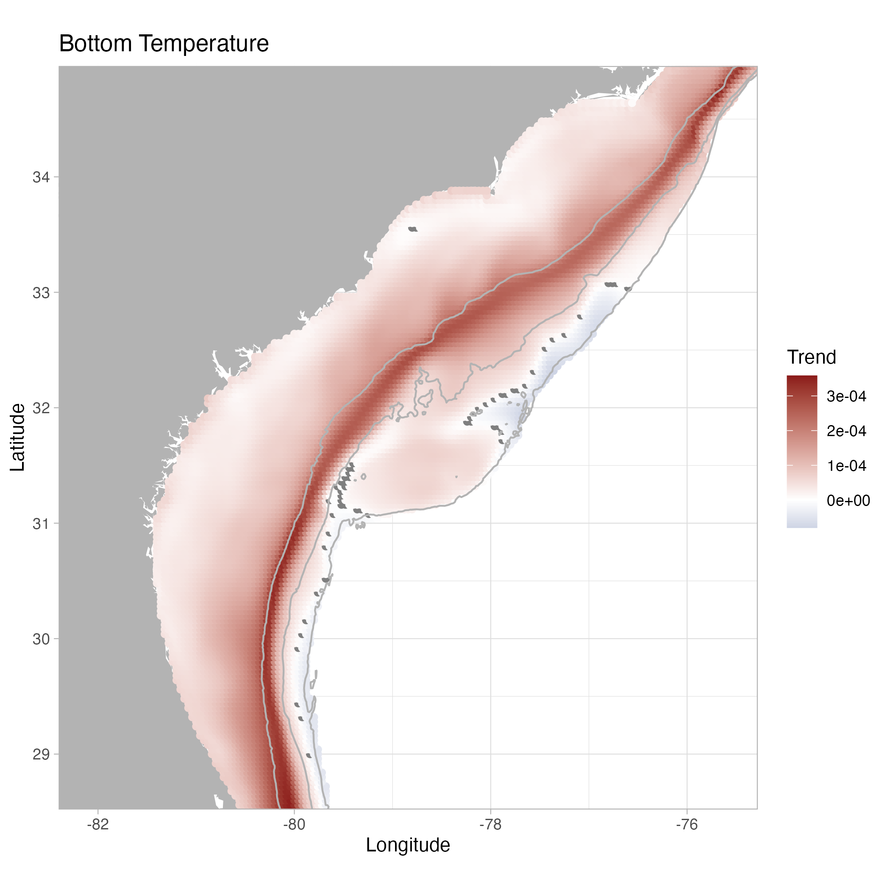

AverageTrend
================

# Trend Linear

<table style="width:100%;">
<colgroup>
<col style="width: 33%" />
<col style="width: 33%" />
<col style="width: 33%" />
</colgroup>
<tbody>
<tr class="odd">
<td style="text-align: center;">

<h2 id="bottom-temperature-1993-2021">Bottom Temperature 1993-2021</h2>

</td>
<td style="text-align: center;">

<h2 id="bottom-temperature-1993-2009">Bottom Temperature 1993-2009</h2>

</td>
<td style="text-align: center;">

<h2 id="bottom-temperature-2010-2021">Bottom Temperature 2010-2021</h2>

</td>
</tr>
</tbody>
</table>

<table style="width:100%;">
<colgroup>
<col style="width: 33%" />
<col style="width: 33%" />
<col style="width: 33%" />
</colgroup>
<tbody>
<tr class="odd">
<td style="text-align: center;">

<h2 id="salinity-1993-2021">Salinity 1993-2021</h2>

</td>
<td style="text-align: center;">

<h2 id="salinity-1993-2009">Salinity 1993-2009</h2>

</td>
<td style="text-align: center;">

<h2 id="salinity-2010-2021">Salinity 2010-2021</h2>

</td>
</tr>
</tbody>
</table>

<table style="width:100%;">
<colgroup>
<col style="width: 33%" />
<col style="width: 33%" />
<col style="width: 33%" />
</colgroup>
<tbody>
<tr class="odd">
<td style="text-align: center;">

<h2 id="ssh-1993-2021">SSH 1993-2021</h2>

</td>
<td style="text-align: center;">

<h2 id="ssh-1993-2009">SSH 1993-2009</h2>

</td>
<td style="text-align: center;">

<h2 id="ssh-2010-2021">SSH 2010-2021</h2>

</td>
</tr>
</tbody>
</table>

<table style="width:100%;">
<colgroup>
<col style="width: 33%" />
<col style="width: 33%" />
<col style="width: 33%" />
</colgroup>
<tbody>
<tr class="odd">
<td style="text-align: center;">

<h2 id="sst-1993-2021">SST 1993-2021</h2>

</td>
<td style="text-align: center;">

<h2 id="sst-1993-2009">SST 1993-2009</h2>

</td>
<td style="text-align: center;">

<h2 id="sst-2010-2021">SST 2010-2021</h2>

</td>
</tr>
</tbody>
</table>

<table style="width:100%;">
<colgroup>
<col style="width: 33%" />
<col style="width: 33%" />
<col style="width: 33%" />
</colgroup>
<tbody>
<tr class="odd">
<td style="text-align: center;">

<h2 id="mixed-layer-1993-2021">Mixed Layer 1993-2021</h2>

</td>
<td style="text-align: center;">

<h2 id="mixed-layer-1993-2009">Mixed Layer 1993-2009</h2>

</td>
<td style="text-align: center;">

<h2 id="mixed-layer-2010-2021">Mixed Layer 2010-2021</h2>

</td>
</tr>
</tbody>
</table>

# Trend

<table style="width:100%;">
<colgroup>
<col style="width: 33%" />
<col style="width: 33%" />
<col style="width: 33%" />
</colgroup>
<tbody>
<tr class="odd">
<td style="text-align: center;">

<h2 id="bottom-temperature-1993-2021-1">Bottom Temperature
1993-2021</h2>

</td>
<td style="text-align: center;">

<h2 id="bottom-temperature-1993-2009-1">Bottom Temperature
1993-2009</h2>

</td>
<td style="text-align: center;">

<h2 id="bottom-temperature-2010-2021-1">Bottom Temperature
2010-2021</h2>

</td>
</tr>
</tbody>
</table>

<table style="width:100%;">
<colgroup>
<col style="width: 33%" />
<col style="width: 33%" />
<col style="width: 33%" />
</colgroup>
<tbody>
<tr class="odd">
<td style="text-align: center;">

<h2 id="salinity-1993-2021-1">Salinity 1993-2021</h2>

</td>
<td style="text-align: center;">

<h2 id="salinity-1993-2009-1">Salinity 1993-2009</h2>

</td>
<td style="text-align: center;">

<h2 id="salinity-2010-2021-1">Salinity 2010-2021</h2>

</td>
</tr>
</tbody>
</table>

<table style="width:100%;">
<colgroup>
<col style="width: 33%" />
<col style="width: 33%" />
<col style="width: 33%" />
</colgroup>
<tbody>
<tr class="odd">
<td style="text-align: center;">

<h2 id="ssh-1993-2021-1">SSH 1993-2021</h2>

</td>
<td style="text-align: center;">

<h2 id="ssh-1993-2009-1">SSH 1993-2009</h2>

</td>
<td style="text-align: center;">

<h2 id="ssh-2010-2021-1">SSH 2010-2021</h2>

</td>
</tr>
</tbody>
</table>

<table style="width:100%;">
<colgroup>
<col style="width: 33%" />
<col style="width: 33%" />
<col style="width: 33%" />
</colgroup>
<tbody>
<tr class="odd">
<td style="text-align: center;">

<h2 id="sst-1993-2021-1">SST 1993-2021</h2>

</td>
<td style="text-align: center;">

<h2 id="sst-1993-2009-1">SST 1993-2009</h2>

</td>
<td style="text-align: center;">

<h2 id="sst-2010-2021-1">SST 2010-2021</h2>

</td>
</tr>
</tbody>
</table>

<table style="width:100%;">
<colgroup>
<col style="width: 33%" />
<col style="width: 33%" />
<col style="width: 33%" />
</colgroup>
<tbody>
<tr class="odd">
<td style="text-align: center;">

<h2 id="mixed-layer-1993-2021-1">Mixed Layer 1993-2021</h2>

</td>
<td style="text-align: center;">

<h2 id="mixed-layer-1993-2009-1">Mixed Layer 1993-2009</h2>

</td>
<td style="text-align: center;">

<h2 id="mixed-layer-2010-2021-1">Mixed Layer 2010-2021</h2>

</td>
</tr>
</tbody>
</table>

# Average

<table style="width:100%;">
<colgroup>
<col style="width: 33%" />
<col style="width: 33%" />
<col style="width: 33%" />
</colgroup>
<tbody>
<tr class="odd">
<td style="text-align: center;">

<h2 id="bottom-temperature-1993-2021-2">Bottom Temperature
1993-2021</h2>

</td>
<td style="text-align: center;">

<h2 id="bottom-temperature-1993-2009-2">Bottom Temperature
1993-2009</h2>

</td>
<td style="text-align: center;">

<h2 id="bottom-temperature-2010-2021-2">Bottom Temperature
2010-2021</h2>

</td>
</tr>
</tbody>
</table>

<table style="width:100%;">
<colgroup>
<col style="width: 33%" />
<col style="width: 33%" />
<col style="width: 33%" />
</colgroup>
<tbody>
<tr class="odd">
<td style="text-align: center;">

<h2 id="salinity-1993-2021-2">Salinity 1993-2021</h2>

</td>
<td style="text-align: center;">

<h2 id="salinity-1993-2009-2">Salinity 1993-2009</h2>

</td>
<td style="text-align: center;">

<h2 id="salinity-2010-2021-2">Salinity 2010-2021</h2>

</td>
</tr>
</tbody>
</table>

<table style="width:100%;">
<colgroup>
<col style="width: 33%" />
<col style="width: 33%" />
<col style="width: 33%" />
</colgroup>
<tbody>
<tr class="odd">
<td style="text-align: center;">

<h2 id="ssh-1993-2021-2">SSH 1993-2021</h2>

</td>
<td style="text-align: center;">

<h2 id="ssh-1993-2009-2">SSH 1993-2009</h2>

</td>
<td style="text-align: center;">

<h2 id="ssh-2010-2021-2">SSH 2010-2021</h2>

</td>
</tr>
</tbody>
</table>

<table style="width:100%;">
<colgroup>
<col style="width: 33%" />
<col style="width: 33%" />
<col style="width: 33%" />
</colgroup>
<tbody>
<tr class="odd">
<td style="text-align: center;">

<h2 id="sst-1993-2021-2">SST 1993-2021</h2>

</td>
<td style="text-align: center;">

<h2 id="sst-1993-2009-2">SST 1993-2009</h2>

</td>
<td style="text-align: center;">

<h2 id="sst-2010-2021-2">SST 2010-2021</h2>

</td>
</tr>
</tbody>
</table>

<table style="width:100%;">
<colgroup>
<col style="width: 33%" />
<col style="width: 33%" />
<col style="width: 33%" />
</colgroup>
<tbody>
<tr class="odd">
<td style="text-align: center;">

<h2 id="mixed-layer-1993-2021-2">Mixed Layer 1993-2021</h2>

</td>
<td style="text-align: center;">

<h2 id="mixed-layer-1993-2009-2">Mixed Layer 1993-2009</h2>

</td>
<td style="text-align: center;">

<h2 id="mixed-layer-2010-2021-2">Mixed Layer 2010-2021</h2>

</td>
</tr>
</tbody>
</table>

# Standard Deviation

<table style="width:100%;">
<colgroup>
<col style="width: 33%" />
<col style="width: 33%" />
<col style="width: 33%" />
</colgroup>
<tbody>
<tr class="odd">
<td style="text-align: center;">

<h2 id="bottom-temperature-1993-2021-3">Bottom Temperature
1993-2021</h2>

</td>
<td style="text-align: center;">

<h2 id="bottom-temperature-1993-2009-3">Bottom Temperature
1993-2009</h2>

</td>
<td style="text-align: center;">

<h2 id="bottom-temperature-2010-2021-3">Bottom Temperature
2010-2021</h2>

</td>
</tr>
</tbody>
</table>

<table style="width:100%;">
<colgroup>
<col style="width: 33%" />
<col style="width: 33%" />
<col style="width: 33%" />
</colgroup>
<tbody>
<tr class="odd">
<td style="text-align: center;">

<h2 id="salinity-1993-2021-3">Salinity 1993-2021</h2>

</td>
<td style="text-align: center;">

<h2 id="salinity-1993-2009-3">Salinity 1993-2009</h2>

</td>
<td style="text-align: center;">

<h2 id="salinity-2010-2021-3">Salinity 2010-2021</h2>

</td>
</tr>
</tbody>
</table>

<table style="width:100%;">
<colgroup>
<col style="width: 33%" />
<col style="width: 33%" />
<col style="width: 33%" />
</colgroup>
<tbody>
<tr class="odd">
<td style="text-align: center;">

<h2 id="ssh-1993-2021-3">SSH 1993-2021</h2>

</td>
<td style="text-align: center;">

<h2 id="ssh-1993-2009-3">SSH 1993-2009</h2>

</td>
<td style="text-align: center;">

<h2 id="ssh-2010-2021-3">SSH 2010-2021</h2>

</td>
</tr>
</tbody>
</table>

<table style="width:100%;">
<colgroup>
<col style="width: 33%" />
<col style="width: 33%" />
<col style="width: 33%" />
</colgroup>
<tbody>
<tr class="odd">
<td style="text-align: center;">

<h2 id="sst-1993-2021-3">SST 1993-2021</h2>

</td>
<td style="text-align: center;">

<h2 id="sst-1993-2009-3">SST 1993-2009</h2>

</td>
<td style="text-align: center;">

<h2 id="sst-2010-2021-3">SST 2010-2021</h2>

</td>
</tr>
</tbody>
</table>

<table style="width:100%;">
<colgroup>
<col style="width: 33%" />
<col style="width: 33%" />
<col style="width: 33%" />
</colgroup>
<tbody>
<tr class="odd">
<td style="text-align: center;">

<h2 id="mixed-layer-1993-2021-3">Mixed Layer 1993-2021</h2>

</td>
<td style="text-align: center;">

<h2 id="mixed-layer-1993-2009-3">Mixed Layer 1993-2009</h2>

</td>
<td style="text-align: center;">

<h2 id="mixed-layer-2010-2021-3">Mixed Layer 2010-2021</h2>

</td>
</tr>
</tbody>
</table>

