CNAPS EOFs with trend
================

# EOF Monthly

<table>
<colgroup>
<col style="width: 50%" />
<col style="width: 50%" />
</colgroup>
<tbody>
<tr class="odd">
<td style="text-align: center;">

<h2 id="bottom-temperature-mode-1">Bottom Temperature Mode 1</h2>

 

</td>
<td style="text-align: center;">

<h2 id="bottom-temperature-mode-2">Bottom Temperature Mode 2</h2>

 

</td>
</tr>
</tbody>
</table>

<table>
<colgroup>
<col style="width: 50%" />
<col style="width: 50%" />
</colgroup>
<tbody>
<tr class="odd">
<td style="text-align: center;">

<h2 id="ssh-mode-1">SSH Mode 1</h2>

</td>
<td style="text-align: center;">

<h2 id="ssh-mode-2">SSH Mode 2</h2>

</td>
</tr>
</tbody>
</table>

<table>
<colgroup>
<col style="width: 50%" />
<col style="width: 50%" />
</colgroup>
<tbody>
<tr class="odd">
<td style="text-align: center;">

<h2 id="sst-mode-1">SST Mode 1</h2>

</td>
<td style="text-align: center;">

<h2 id="sst-mode-2">SST Mode 2</h2>

</td>
</tr>
</tbody>
</table>

<table>
<colgroup>
<col style="width: 50%" />
<col style="width: 50%" />
</colgroup>
<tbody>
<tr class="odd">
<td style="text-align: center;">

<h2 id="mixed-layer-mode-1">Mixed Layer Mode 1</h2>

</td>
<td style="text-align: center;">

<h2 id="mixed-layer-mode-2">Mixed Layer Mode 2</h2>

</td>
</tr>
</tbody>
</table>

# EOF Seasonal

## Bottom Temperature

<table>
<colgroup>
<col style="width: 50%" />
<col style="width: 50%" />
</colgroup>
<tbody>
<tr class="odd">
<td style="text-align: center;">

<h3 id="bottom-temperature-winter-mode-1">Bottom Temperature Winter Mode
1</h3>

</td>
<td style="text-align: center;">

<h3 id="bottom-temperature-winter-mode-2">Bottom Temperature Winter Mode
2</h3>

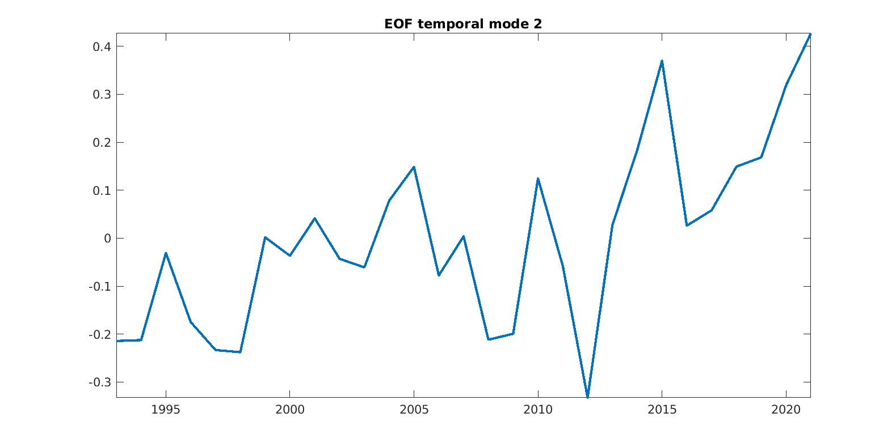

</td>
</tr>
</tbody>
</table>

<table>
<colgroup>
<col style="width: 50%" />
<col style="width: 50%" />
</colgroup>
<tbody>
<tr class="odd">
<td style="text-align: center;">

<h3 id="bottom-temperature-spring-mode-1">Bottom Temperature Spring Mode
1</h3>

</td>
<td style="text-align: center;">

<h3 id="bottom-temperature-spring-mode-2">Bottom Temperature Spring Mode
2</h3>

</td>
</tr>
</tbody>
</table>

<table>
<colgroup>
<col style="width: 50%" />
<col style="width: 50%" />
</colgroup>
<tbody>
<tr class="odd">
<td style="text-align: center;">

<h3 id="bottom-temperature-summer-mode-1">Bottom Temperature Summer Mode
1</h3>

</td>
<td style="text-align: center;">

<h3 id="bottom-temperature-summer-mode-2">Bottom Temperature Summer Mode
2</h3>

</td>
</tr>
</tbody>
</table>

<table>
<colgroup>
<col style="width: 50%" />
<col style="width: 50%" />
</colgroup>
<tbody>
<tr class="odd">
<td style="text-align: center;">

<h3 id="bottom-temperature-fall-mode-1">Bottom Temperature Fall Mode
1</h3>

</td>
<td style="text-align: center;">

<h3 id="bottom-temperature-fall-mode-2">Bottom Temperature Fall Mode
2</h3>

</td>
</tr>
</tbody>
</table>

## SSH

<table>
<colgroup>
<col style="width: 50%" />
<col style="width: 50%" />
</colgroup>
<tbody>
<tr class="odd">
<td style="text-align: center;">

<h3 id="ssh-winter-mode-1">SSH Winter Mode 1</h3>

</td>
<td style="text-align: center;">

<h3 id="ssh-winter-mode-2">SSH Winter Mode 2</h3>

</td>
</tr>
</tbody>
</table>

<table>
<colgroup>
<col style="width: 50%" />
<col style="width: 50%" />
</colgroup>
<tbody>
<tr class="odd">
<td style="text-align: center;">

<h3 id="ssh-spring-mode-1">SSH Spring Mode 1</h3>

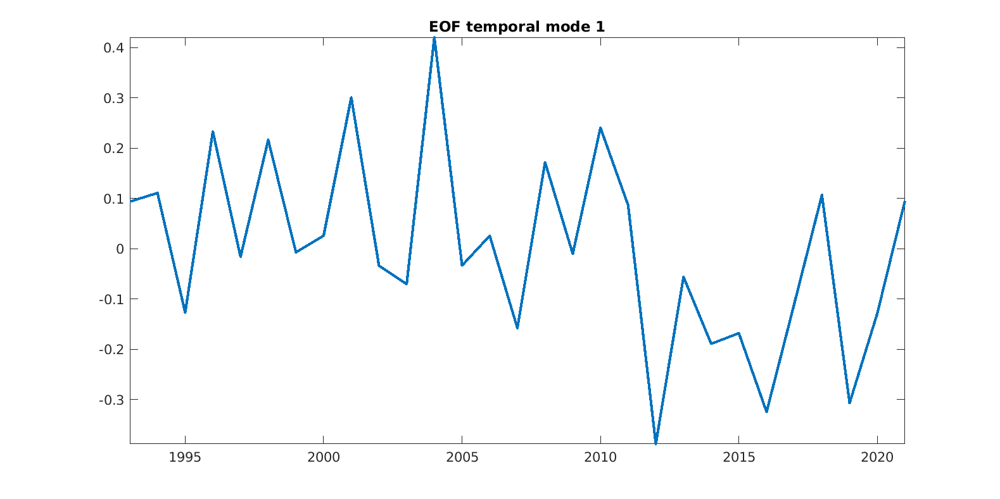

</td>
<td style="text-align: center;">

<h3 id="ssh-spring-mode-2">SSH Spring Mode 2</h3>

</td>
</tr>
</tbody>
</table>

<table>
<colgroup>
<col style="width: 50%" />
<col style="width: 50%" />
</colgroup>
<tbody>
<tr class="odd">
<td style="text-align: center;">

<h3 id="ssh-summer-mode-1">SSH Summer Mode 1</h3>

</td>
<td style="text-align: center;">

<h3 id="ssh-summer-mode-2">SSH Summer Mode 2</h3>

</td>
</tr>
</tbody>
</table>

<table>
<colgroup>
<col style="width: 50%" />
<col style="width: 50%" />
</colgroup>
<tbody>
<tr class="odd">
<td style="text-align: center;">

<h3 id="ssh-fall-mode-1">SSH Fall Mode 1</h3>

 

</td>
<td style="text-align: center;">

<h3 id="ssh-fall-mode-2">SSH Fall Mode 2</h3>

 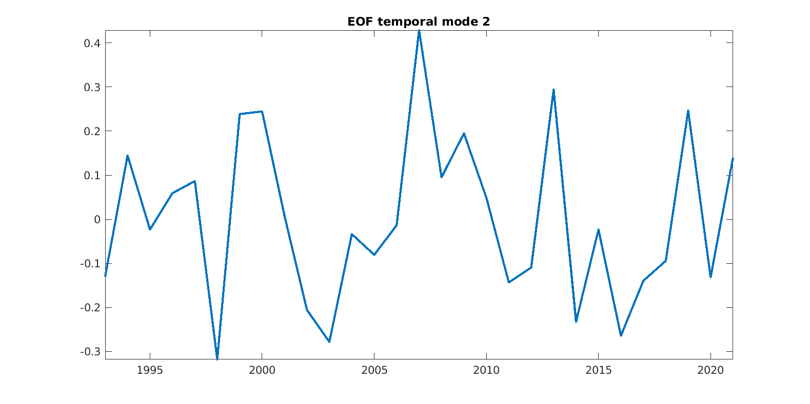

</td>
</tr>
</tbody>
</table>

## SST

<table>
<colgroup>
<col style="width: 50%" />
<col style="width: 50%" />
</colgroup>
<tbody>
<tr class="odd">
<td style="text-align: center;">

<h3 id="sst-winter-mode-1">SST Winter Mode 1</h3>

</td>
<td style="text-align: center;">

<h3 id="sst-winter-mode-2">SST Winter Mode 2</h3>

</td>
</tr>
</tbody>
</table>

<table>
<colgroup>
<col style="width: 50%" />
<col style="width: 50%" />
</colgroup>
<tbody>
<tr class="odd">
<td style="text-align: center;">

<h3 id="sst-spring-mode-1">SST Spring Mode 1</h3>

</td>
<td style="text-align: center;">

<h3 id="sst-spring-mode-2">SST Spring Mode 2</h3>

</td>
</tr>
</tbody>
</table>

<table>
<colgroup>
<col style="width: 50%" />
<col style="width: 50%" />
</colgroup>
<tbody>
<tr class="odd">
<td style="text-align: center;">

<h3 id="sst-summer-mode-1">SST Summer Mode 1</h3>

</td>
<td style="text-align: center;">

<h3 id="sst-summer-mode-2">SST Summer Mode 2</h3>

</td>
</tr>
</tbody>
</table>

<table>
<colgroup>
<col style="width: 50%" />
<col style="width: 50%" />
</colgroup>
<tbody>
<tr class="odd">
<td style="text-align: center;">

<h3 id="sst-fall-mode-1">SST Fall Mode 1</h3>

 

</td>
<td style="text-align: center;">

<h3 id="sst-fall-mode-2">SST Fall Mode 2</h3>

 

</td>
</tr>
</tbody>
</table>

## Mixed Layer

<table>
<colgroup>
<col style="width: 50%" />
<col style="width: 50%" />
</colgroup>
<tbody>
<tr class="odd">
<td style="text-align: center;">

<h3 id="mixed-layer-winter-mode-1">Mixed Layer Winter Mode 1</h3>

</td>
<td style="text-align: center;">

<h3 id="mixed-layer-winter-mode-2">Mixed Layer Winter Mode 2</h3>

</td>
</tr>
</tbody>
</table>

<table>
<colgroup>
<col style="width: 50%" />
<col style="width: 50%" />
</colgroup>
<tbody>
<tr class="odd">
<td style="text-align: center;">

<h3 id="mixed-layer-spring-mode-1">Mixed Layer Spring Mode 1</h3>

</td>
<td style="text-align: center;">

<h3 id="mixed-layer-spring-mode-2">Mixed Layer Spring Mode 2</h3>

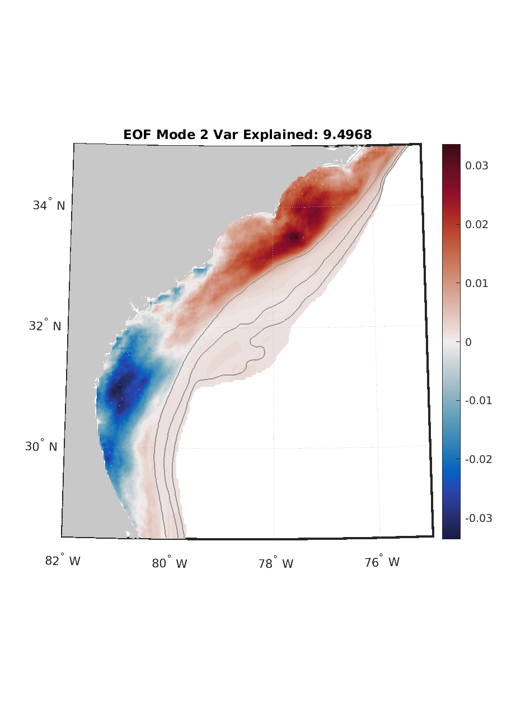
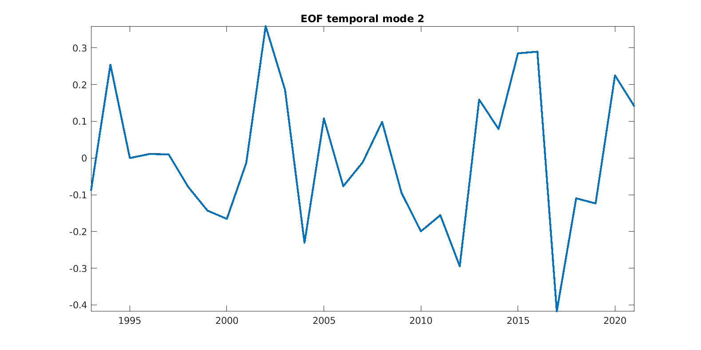

</td>
</tr>
</tbody>
</table>

<table>
<colgroup>
<col style="width: 50%" />
<col style="width: 50%" />
</colgroup>
<tbody>
<tr class="odd">
<td style="text-align: center;">

<h3 id="mixed-layer-summer-mode-1">Mixed Layer Summer Mode 1</h3>

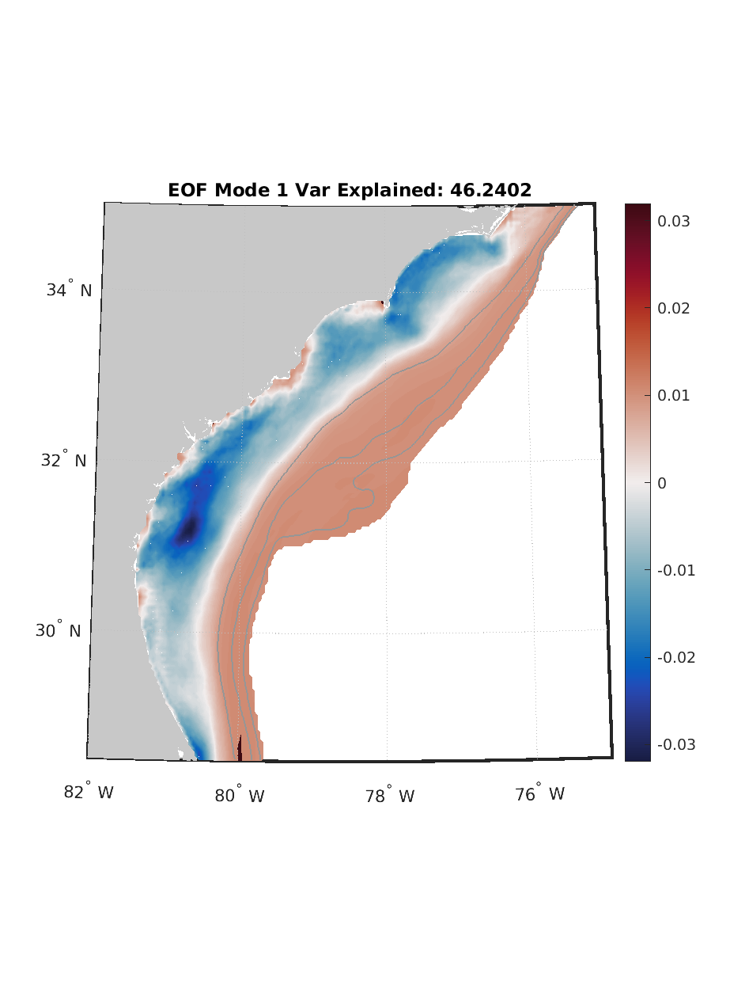
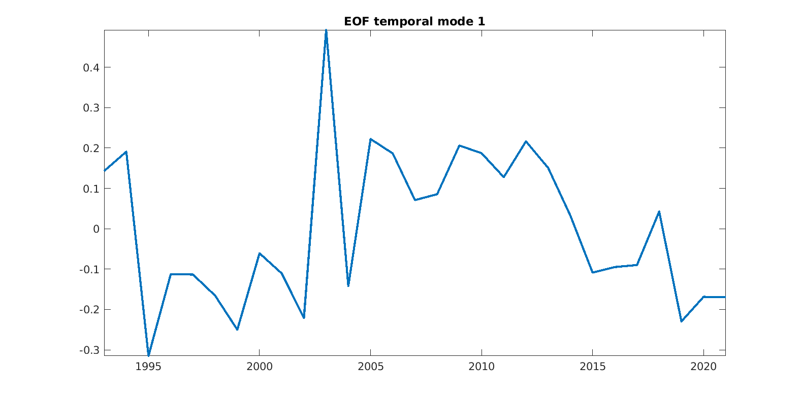

</td>
<td style="text-align: center;">

<h3 id="mixed-layer-summer-mode-2">Mixed Layer Summer Mode 2</h3>

</td>
</tr>
</tbody>
</table>

<table>
<colgroup>
<col style="width: 50%" />
<col style="width: 50%" />
</colgroup>
<tbody>
<tr class="odd">
<td style="text-align: center;">

<h3 id="mixed-layer-fall-mode-1">Mixed Layer Fall Mode 1</h3>

</td>
<td style="text-align: center;">

<h3 id="mixed-layer-fall-mode-2">Mixed Layer Fall Mode 2</h3>

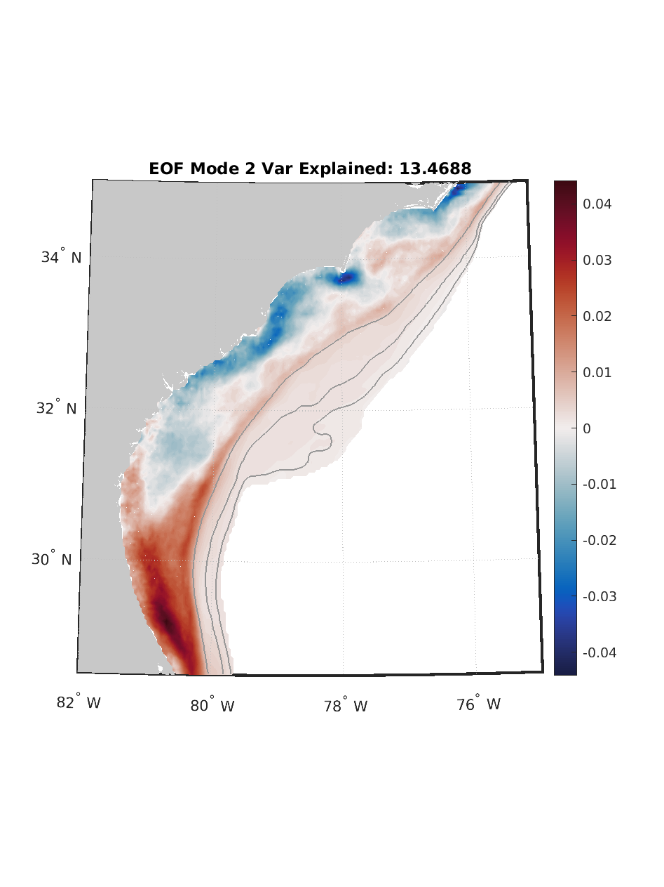

</td>
</tr>
</tbody>
</table>

# EOF Seasonal Spawning

## Bottom Temperature

<table>
<colgroup>
<col style="width: 50%" />
<col style="width: 50%" />
</colgroup>
<tbody>
<tr class="odd">
<td style="text-align: center;">

<h3 id="bottom-temperature-spawning-winter-mode-1">Bottom Temperature
Spawning Winter Mode 1</h3>

</td>
<td style="text-align: center;">

<h3 id="bottom-temperature-spawning-winter-mode-2">Bottom Temperature
Spawning Winter Mode 2</h3>

</td>
</tr>
</tbody>
</table>

<table>
<colgroup>
<col style="width: 50%" />
<col style="width: 50%" />
</colgroup>
<tbody>
<tr class="odd">
<td style="text-align: center;">

<h3 id="bottom-temperature-spawning-summer-mode-1">Bottom Temperature
Spawning Summer Mode 1</h3>

</td>
<td style="text-align: center;">

<h3 id="bottom-temperature-spawning-summer-mode-2">Bottom Temperature
Spawning Summer Mode 2</h3>

</td>
</tr>
</tbody>
</table>

## SSH

<table>
<colgroup>
<col style="width: 50%" />
<col style="width: 50%" />
</colgroup>
<tbody>
<tr class="odd">
<td style="text-align: center;">

<h3 id="ssh-spawning-winter-mode-1">SSH Spawning Winter Mode 1</h3>

</td>
<td style="text-align: center;">

<h3 id="ssh-spawning-winter-mode-2">SSH Spawning Winter Mode 2</h3>

</td>
</tr>
</tbody>
</table>

<table>
<colgroup>
<col style="width: 50%" />
<col style="width: 50%" />
</colgroup>
<tbody>
<tr class="odd">
<td style="text-align: center;">

<h3 id="ssh-spawning-summer-mode-1">SSH Spawning Summer Mode 1</h3>

</td>
<td style="text-align: center;">

<h3 id="ssh-spawning-summer-mode-2">SSH Spawning Summer Mode 2</h3>

</td>
</tr>
</tbody>
</table>

## SST

<table>
<colgroup>
<col style="width: 50%" />
<col style="width: 50%" />
</colgroup>
<tbody>
<tr class="odd">
<td style="text-align: center;">

<h3 id="sst-spawning-winter-mode-1">SST Spawning Winter Mode 1</h3>

</td>
<td style="text-align: center;">

<h3 id="sst-spawning-winter-mode-2">SST Spawning Winter Mode 2</h3>

</td>
</tr>
</tbody>
</table>

<table>
<colgroup>
<col style="width: 50%" />
<col style="width: 50%" />
</colgroup>
<tbody>
<tr class="odd">
<td style="text-align: center;">

<h3 id="sst-spawning-summer-mode-1">SST Spawning Summer Mode 1</h3>

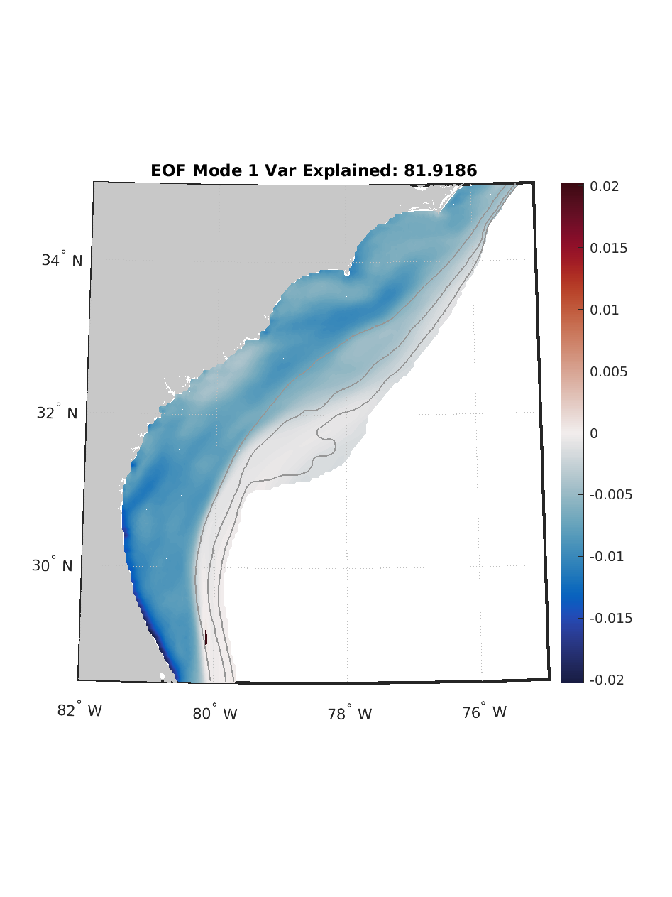

</td>
<td style="text-align: center;">

<h3 id="sst-spawning-summer-mode-2">SST Spawning Summer Mode 2</h3>

</td>
</tr>
</tbody>
</table>

## Mixed Layer

<table>
<colgroup>
<col style="width: 50%" />
<col style="width: 50%" />
</colgroup>
<tbody>
<tr class="odd">
<td style="text-align: center;">

<h3 id="mixed-layer-spawning-winter-mode-1">Mixed Layer Spawning Winter
Mode 1</h3>

</td>
<td style="text-align: center;">

<h3 id="mixed-layer-spawning-winter-mode-2">Mixed Layer Spawning Winter
Mode 2</h3>

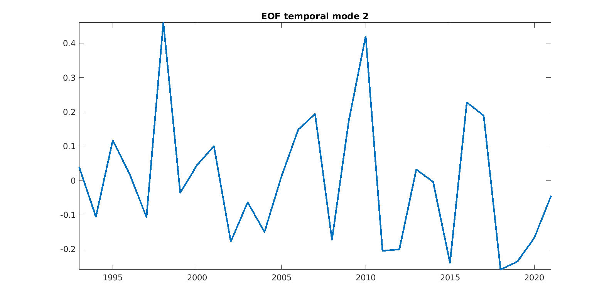

</td>
</tr>
</tbody>
</table>

<table>
<colgroup>
<col style="width: 50%" />
<col style="width: 50%" />
</colgroup>
<tbody>
<tr class="odd">
<td style="text-align: center;">

<h3 id="mixed-layer-spawning-summer-mode-1">Mixed Layer Spawning Summer
Mode 1</h3>

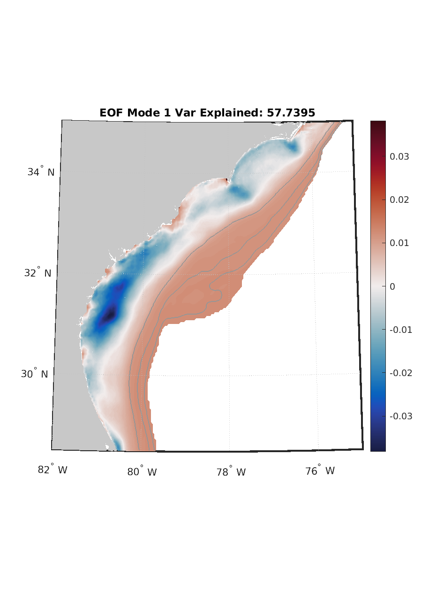

</td>
<td style="text-align: center;">

<h3 id="mixed-layer-spawning-summer-mode-2">Mixed Layer Spawning Summer
Mode 2</h3>

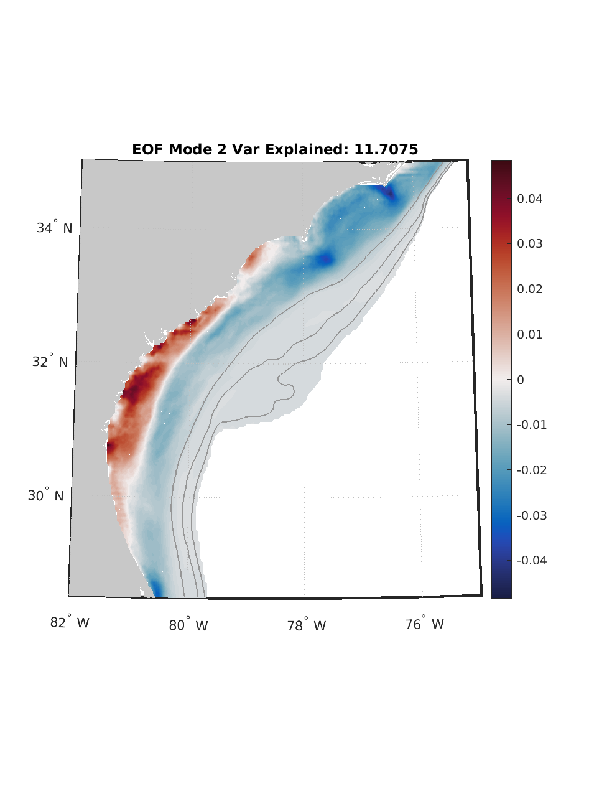
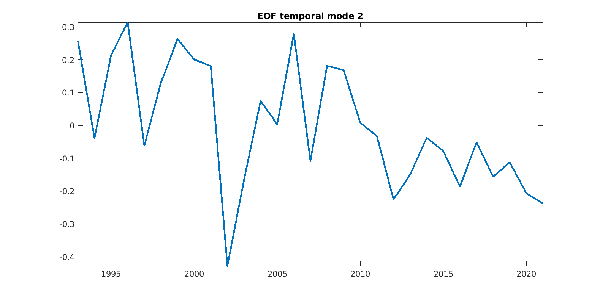

</td>
</tr>
</tbody>
</table>

# EOF Seasonal Spawning All Months

## Bottom Temperature

<table>
<colgroup>
<col style="width: 50%" />
<col style="width: 50%" />
</colgroup>
<tbody>
<tr class="odd">
<td style="text-align: center;">

<h3 id="bottom-temperature-spawning-winter-mode-1-1">Bottom Temperature
Spawning Winter Mode 1</h3>

</td>
<td style="text-align: center;">

<h3 id="bottom-temperature-spawning-winter-mode-2-1">Bottom Temperature
Spawning Winter Mode 2</h3>

</td>
</tr>
</tbody>
</table>

<table>
<colgroup>
<col style="width: 50%" />
<col style="width: 50%" />
</colgroup>
<tbody>
<tr class="odd">
<td style="text-align: center;">

<h3 id="bottom-temperature-spawning-spring-mode-1">Bottom Temperature
Spawning Spring Mode 1</h3>

</td>
<td style="text-align: center;">

<h3 id="bottom-temperature-spawning-spring-mode-2">Bottom Temperature
Spawning Spring Mode 2</h3>

</td>
</tr>
</tbody>
</table>

## SSH

<table>
<colgroup>
<col style="width: 50%" />
<col style="width: 50%" />
</colgroup>
<tbody>
<tr class="odd">
<td style="text-align: center;">

<h3 id="ssh-spawning-winter-mode-1-1">SSH Spawning Winter Mode 1</h3>

</td>
<td style="text-align: center;">

<h3 id="ssh-spawning-winter-mode-2-1">SSH Spawning Winter Mode 2</h3>

</td>
</tr>
</tbody>
</table>

<table>
<colgroup>
<col style="width: 50%" />
<col style="width: 50%" />
</colgroup>
<tbody>
<tr class="odd">
<td style="text-align: center;">

<h3 id="ssh-spawning-spring-mode-1">SSH Spawning Spring Mode 1</h3>

</td>
<td style="text-align: center;">

<h3 id="ssh-spawning-spring-mode-2">SSH Spawning Spring Mode 2</h3>

</td>
</tr>
</tbody>
</table>

## SST

<table>
<colgroup>
<col style="width: 50%" />
<col style="width: 50%" />
</colgroup>
<tbody>
<tr class="odd">
<td style="text-align: center;">

<h3 id="sst-spawning-winter-mode-1-1">SST Spawning Winter Mode 1</h3>

</td>
<td style="text-align: center;">

<h3 id="sst-spawning-winter-mode-2-1">SST Spawning Winter Mode 2</h3>

</td>
</tr>
</tbody>
</table>

<table>
<colgroup>
<col style="width: 50%" />
<col style="width: 50%" />
</colgroup>
<tbody>
<tr class="odd">
<td style="text-align: center;">

<h3 id="sst-spawning-spring-mode-1">SST Spawning Spring Mode 1</h3>

</td>
<td style="text-align: center;">

<h3 id="sst-spawning-spring-mode-2">SST Spawning Spring Mode 2</h3>

</td>
</tr>
</tbody>
</table>

## Mixed Layer

<table>
<colgroup>
<col style="width: 50%" />
<col style="width: 50%" />
</colgroup>
<tbody>
<tr class="odd">
<td style="text-align: center;">

<h3 id="mixed-layer-spawning-winter-mode-1-1">Mixed Layer Spawning
Winter Mode 1</h3>

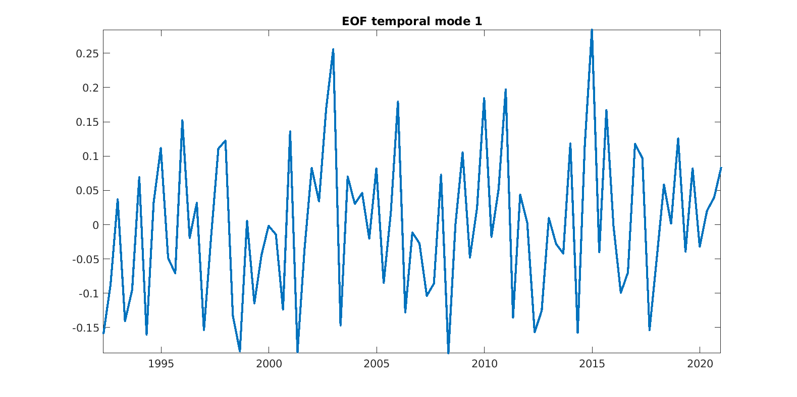

</td>
<td style="text-align: center;">

<h3 id="mixed-layer-spawning-winter-mode-2-1">Mixed Layer Spawning
Winter Mode 2</h3>

</td>
</tr>
</tbody>
</table>

<table>
<colgroup>
<col style="width: 50%" />
<col style="width: 50%" />
</colgroup>
<tbody>
<tr class="odd">
<td style="text-align: center;">

<h3 id="mixed-layer-spawning-spring-mode-1">Mixed Layer Spawning Spring
Mode 1</h3>

</td>
<td style="text-align: center;">

<h3 id="mixed-layer-spawning-spring-mode-2">Mixed Layer Spawning Spring
Mode 2</h3>

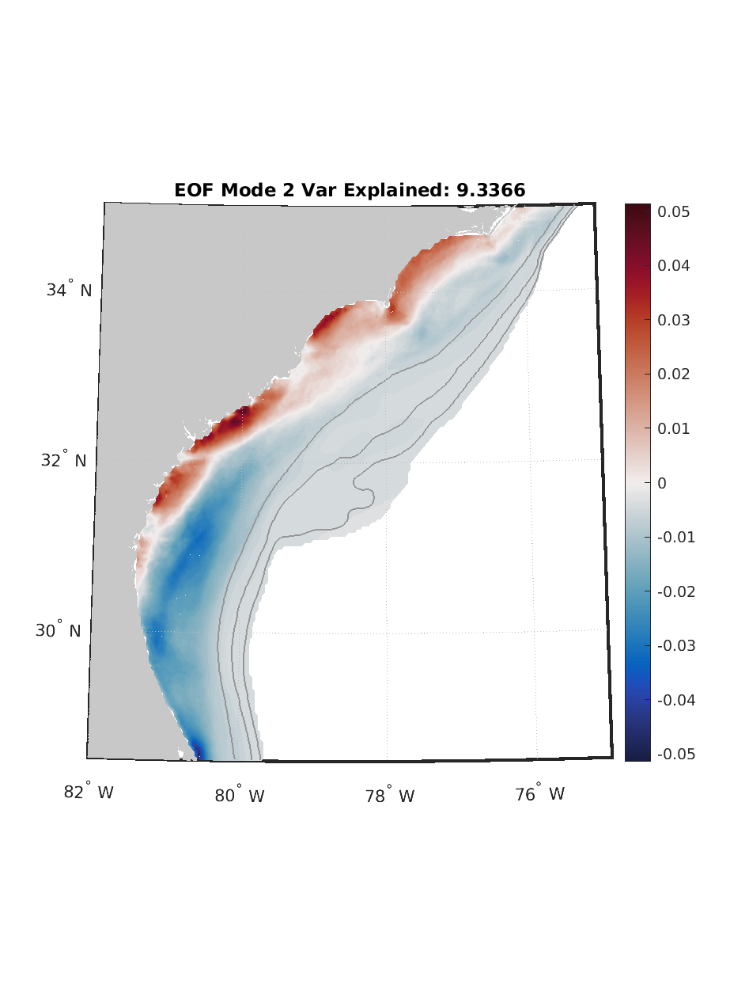

</td>
</tr>
</tbody>
</table>

