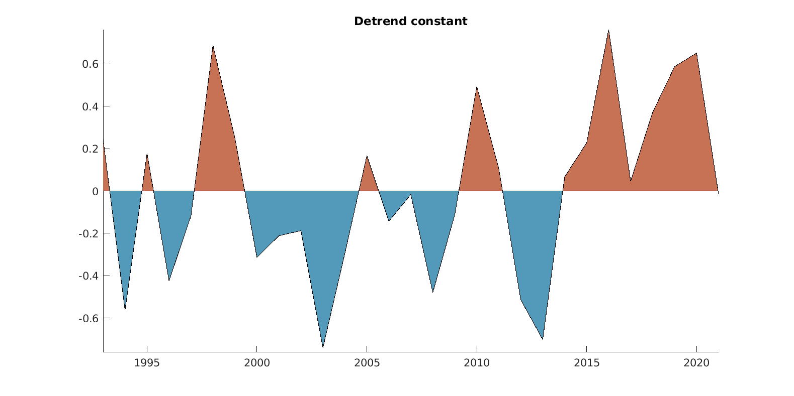
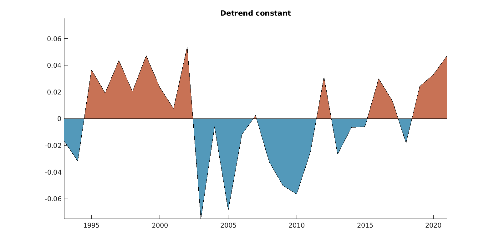
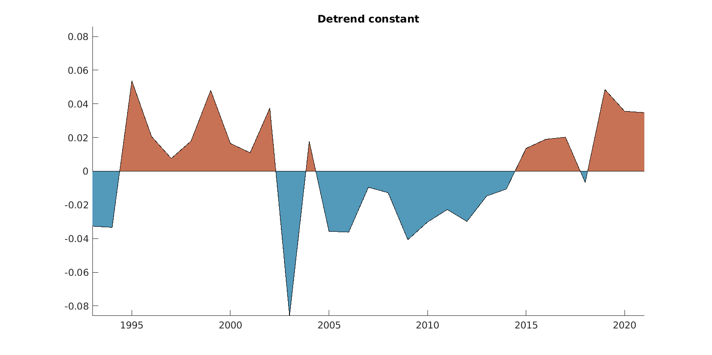
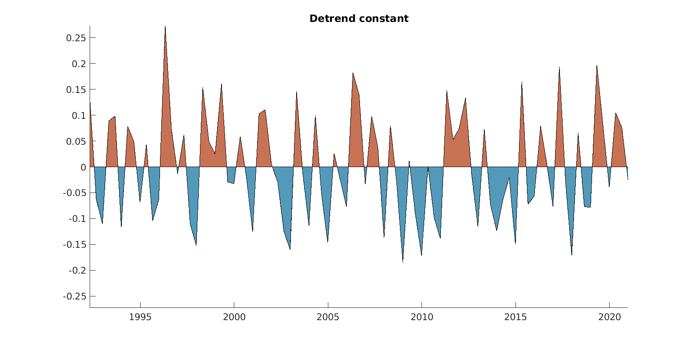
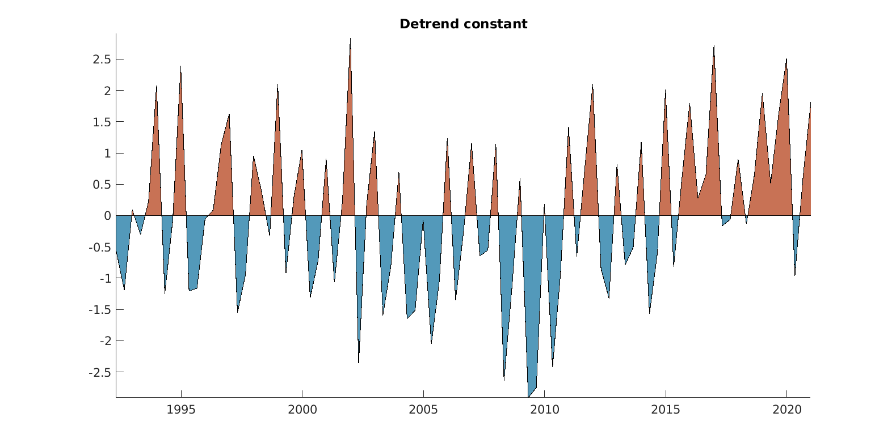

Anomalies CNAPS
================

# Monthly anomalies

<table>
<colgroup>
<col style="width: 50%" />
<col style="width: 50%" />
</colgroup>
<tbody>
<tr class="odd">
<td style="text-align: center;">

<h2 id="bottom-temperature">Bottom Temperature</h2>

</td>
<td style="text-align: center;">

<h2 id="ssh">SSH</h2>

</td>
</tr>
</tbody>
</table>

<table>
<colgroup>
<col style="width: 50%" />
<col style="width: 50%" />
</colgroup>
<tbody>
<tr class="odd">
<td style="text-align: center;">

<h2 id="sst">SST</h2>

</td>
<td style="text-align: center;">

<h2 id="mixed-layer">Mixed Layer</h2>

</td>
</tr>
</tbody>
</table>

# Spawning Season Anomalies

- Winter: February, March, April

- Summer: June, July, August

<table>
<colgroup>
<col style="width: 50%" />
<col style="width: 50%" />
</colgroup>
<tbody>
<tr class="odd">
<td style="text-align: center;">

<h2 id="bottom-temperature-winter">Bottom Temperature Winter</h2>

</td>
<td style="text-align: center;">

<h2 id="bottom-temperature-summer">Bottom Temperature Summer</h2>

</td>
</tr>
</tbody>
</table>

<table>
<colgroup>
<col style="width: 50%" />
<col style="width: 50%" />
</colgroup>
<tbody>
<tr class="odd">
<td style="text-align: center;">

<h2 id="ssh-winter">SSH Winter</h2>

</td>
<td style="text-align: center;">

<h2 id="ssh-summer">SSH Summer</h2>

</td>
</tr>
</tbody>
</table>

<table>
<colgroup>
<col style="width: 50%" />
<col style="width: 50%" />
</colgroup>
<tbody>
<tr class="odd">
<td style="text-align: center;">

<h2 id="sst-winter">SST Winter</h2>

</td>
<td style="text-align: center;">

<h2 id="sst-summer">SST Summer</h2>

</td>
</tr>
</tbody>
</table>

<table>
<colgroup>
<col style="width: 50%" />
<col style="width: 50%" />
</colgroup>
<tbody>
<tr class="odd">
<td style="text-align: center;">

<h2 id="mixed-layer-winter">Mixed Layer Winter</h2>

</td>
<td style="text-align: center;">

<h2 id="mixed-layer-summer">Mixed Layer Summer</h2>

</td>
</tr>
</tbody>
</table>

# Seasonal Anomalies

<table>
<colgroup>
<col style="width: 50%" />
<col style="width: 50%" />
</colgroup>
<tbody>
<tr class="odd">
<td style="text-align: center;">

<h2 id="bottom-temperature-winter-1">Bottom Temperature Winter</h2>

</td>
<td style="text-align: center;">

<h2 id="bottom-temperature-spring">Bottom Temperature Spring</h2>

</td>
</tr>
</tbody>
</table>

<table>
<colgroup>
<col style="width: 50%" />
<col style="width: 50%" />
</colgroup>
<tbody>
<tr class="odd">
<td style="text-align: center;">

<h2 id="bottom-temperature-summer-1">Bottom Temperature Summer</h2>

</td>
<td style="text-align: center;">

<h2 id="bottom-temperature-fall">Bottom Temperature Fall</h2>

</td>
</tr>
</tbody>
</table>

<table>
<colgroup>
<col style="width: 50%" />
<col style="width: 50%" />
</colgroup>
<tbody>
<tr class="odd">
<td style="text-align: center;">

<h2 id="ssh-winter-1">SSH Winter</h2>

</td>
<td style="text-align: center;">

<h2 id="ssh-spring">SSH Spring</h2>

</td>
</tr>
</tbody>
</table>

<table>
<colgroup>
<col style="width: 50%" />
<col style="width: 50%" />
</colgroup>
<tbody>
<tr class="odd">
<td style="text-align: center;">

<h2 id="ssh-summer-1">SSH Summer</h2>

</td>
<td style="text-align: center;">

<h2 id="ssh-fall">SSH Fall</h2>

</td>
</tr>
</tbody>
</table>

<table>
<colgroup>
<col style="width: 50%" />
<col style="width: 50%" />
</colgroup>
<tbody>
<tr class="odd">
<td style="text-align: center;">

<h2 id="sst-winter-1">SST Winter</h2>

</td>
<td style="text-align: center;">

<h2 id="sst-spring">SST Spring</h2>

</td>
</tr>
</tbody>
</table>

<table>
<colgroup>
<col style="width: 50%" />
<col style="width: 50%" />
</colgroup>
<tbody>
<tr class="odd">
<td style="text-align: center;">

<h2 id="sst-summer-1">SST Summer</h2>

</td>
<td style="text-align: center;">

<h2 id="sst-fall">SST Fall</h2>

</td>
</tr>
</tbody>
</table>

<table>
<colgroup>
<col style="width: 50%" />
<col style="width: 50%" />
</colgroup>
<tbody>
<tr class="odd">
<td style="text-align: center;">

<h2 id="mixed-layer-winter-1">Mixed Layer Winter</h2>

</td>
<td style="text-align: center;">

<h2 id="mixed-layer-spring">Mixed Layer Spring</h2>

</td>
</tr>
</tbody>
</table>

<table>
<colgroup>
<col style="width: 50%" />
<col style="width: 50%" />
</colgroup>
<tbody>
<tr class="odd">
<td style="text-align: center;">

<h2 id="mixed-layer-summer-1">Mixed Layer Summer</h2>

</td>
<td style="text-align: center;">

<h2 id="mixed-layer-fall">Mixed Layer Fall</h2>

</td>
</tr>
</tbody>
</table>

# Seasonal Anomalies (by Months)

Here we have 3 points of observations for each season

<table>
<colgroup>
<col style="width: 50%" />
<col style="width: 50%" />
</colgroup>
<tbody>
<tr class="odd">
<td style="text-align: center;">

<h2 id="bottom-temperature-winter-2">Bottom Temperature Winter</h2>

</td>
<td style="text-align: center;">

<h2 id="bottom-temperature-spring-1">Bottom Temperature Spring</h2>

</td>
</tr>
</tbody>
</table>

<table>
<colgroup>
<col style="width: 50%" />
<col style="width: 50%" />
</colgroup>
<tbody>
<tr class="odd">
<td style="text-align: center;">

<h2 id="bottom-temperature-summer-2">Bottom Temperature Summer</h2>

</td>
<td style="text-align: center;">

<h2 id="bottom-temperature-fall-1">Bottom Temperature Fall</h2>

</td>
</tr>
</tbody>
</table>

<table>
<colgroup>
<col style="width: 50%" />
<col style="width: 50%" />
</colgroup>
<tbody>
<tr class="odd">
<td style="text-align: center;">

<h2 id="ssh-winter-2">SSH Winter</h2>

</td>
<td style="text-align: center;">

<h2 id="ssh-spring-1">SSH Spring</h2>

</td>
</tr>
</tbody>
</table>

<table>
<colgroup>
<col style="width: 50%" />
<col style="width: 50%" />
</colgroup>
<tbody>
<tr class="odd">
<td style="text-align: center;">

<h2 id="ssh-summer-2">SSH Summer</h2>

</td>
<td style="text-align: center;">

<h2 id="ssh-fall-1">SSH Fall</h2>

</td>
</tr>
</tbody>
</table>

<table>
<colgroup>
<col style="width: 50%" />
<col style="width: 50%" />
</colgroup>
<tbody>
<tr class="odd">
<td style="text-align: center;">

<h2 id="sst-winter-2">SST Winter</h2>

</td>
<td style="text-align: center;">

<h2 id="sst-spring-1">SST Spring</h2>

</td>
</tr>
</tbody>
</table>

<table>
<colgroup>
<col style="width: 50%" />
<col style="width: 50%" />
</colgroup>
<tbody>
<tr class="odd">
<td style="text-align: center;">

<h2 id="sst-summer-2">SST Summer</h2>

</td>
<td style="text-align: center;">

<h2 id="sst-fall-1">SST Fall</h2>

</td>
</tr>
</tbody>
</table>

<table>
<colgroup>
<col style="width: 50%" />
<col style="width: 50%" />
</colgroup>
<tbody>
<tr class="odd">
<td style="text-align: center;">

<h2 id="mixed-layer-winter-2">Mixed Layer Winter</h2>

</td>
<td style="text-align: center;">

<h2 id="mixed-layer-spring-1">Mixed Layer Spring</h2>

</td>
</tr>
</tbody>
</table>

<table>
<colgroup>
<col style="width: 50%" />
<col style="width: 50%" />
</colgroup>
<tbody>
<tr class="odd">
<td style="text-align: center;">

<h2 id="mixed-layer-summer-2">Mixed Layer Summer</h2>

</td>
<td style="text-align: center;">

<h2 id="mixed-layer-fall-1">Mixed Layer Fall</h2>

</td>
</tr>
</tbody>
</table>

# Spawning Season Anomalies

- Winter: February, March, April

- Spring: June, July, August

<table>
<colgroup>
<col style="width: 50%" />
<col style="width: 50%" />
</colgroup>
<tbody>
<tr class="odd">
<td style="text-align: center;">

<h2 id="bottom-temperature-winter-3">Bottom Temperature Winter</h2>

</td>
<td style="text-align: center;">

<h2 id="bottom-temperature-spring-2">Bottom Temperature Spring</h2>

</td>
</tr>
</tbody>
</table>

<table>
<colgroup>
<col style="width: 50%" />
<col style="width: 50%" />
</colgroup>
<tbody>
<tr class="odd">
<td style="text-align: center;">

<h2 id="ssh-winter-3">SSH Winter</h2>

</td>
<td style="text-align: center;">

<h2 id="ssh-spring-2">SSH Spring</h2>

</td>
</tr>
</tbody>
</table>

<table>
<colgroup>
<col style="width: 50%" />
<col style="width: 50%" />
</colgroup>
<tbody>
<tr class="odd">
<td style="text-align: center;">

<h2 id="sst-winter-3">SST Winter</h2>

</td>
<td style="text-align: center;">

<h2 id="sst-spring-2">SST Spring</h2>

</td>
</tr>
</tbody>
</table>

<table>
<colgroup>
<col style="width: 50%" />
<col style="width: 50%" />
</colgroup>
<tbody>
<tr class="odd">
<td style="text-align: center;">

<h2 id="mixed-layer-winter-3">Mixed Layer Winter</h2>

</td>
<td style="text-align: center;">

<h2 id="mixed-layer-spring-2">Mixed Layer Spring</h2>

</td>
</tr>
</tbody>
</table>

