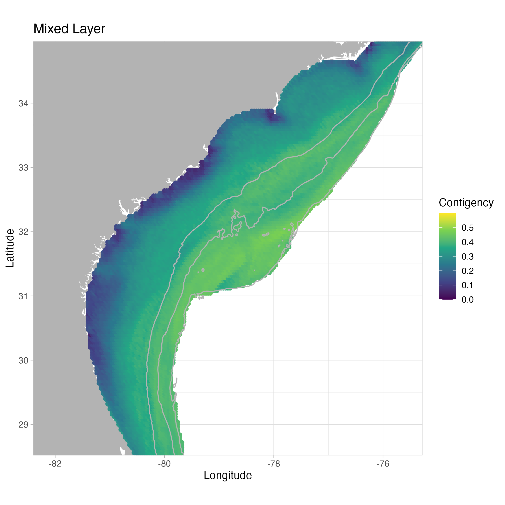
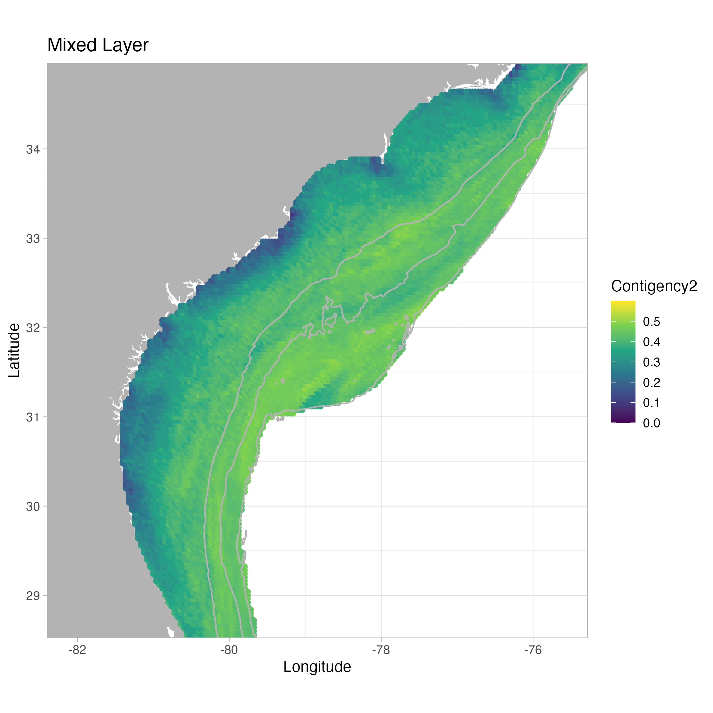
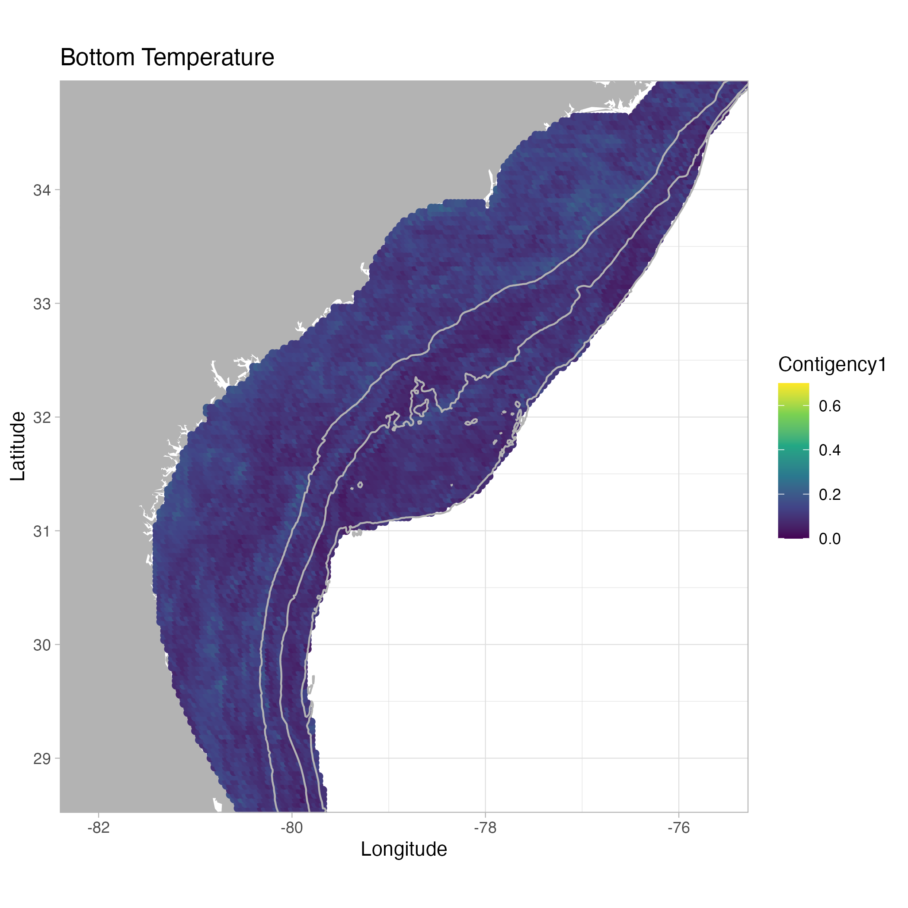
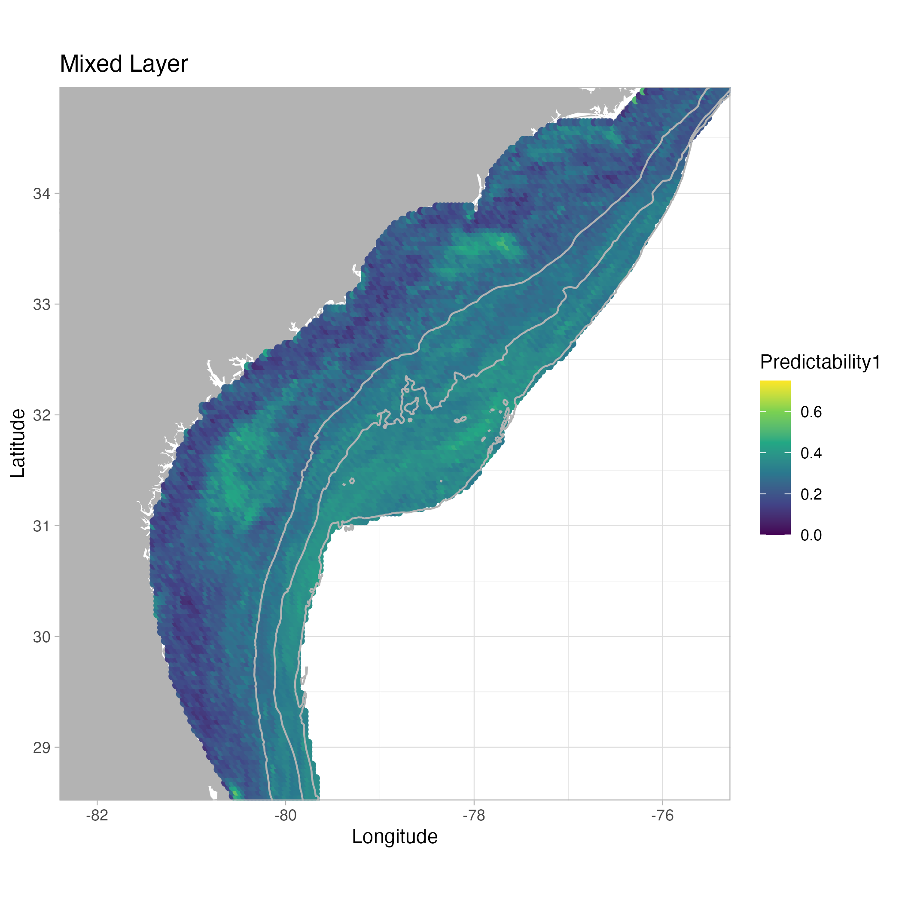

Colwell
================

- Seasonality: fraction of the total variance that is due to predictable
  seasonal periodicity

- Color: White noise occurs when there is no correlation between one
  measurement and the next, while for reddened noise, there is some
  correlation between measurements separated by a finite time-scale

- Constancy (C): measures the extent to which the environment is the
  same for all months in all years

- Contingency (M): measures the extent to which the environmental
  differences between months are the same in all years

- Predictability (P): is the sum of Constancy (C) and Contingency (M)

# Seasonality

<table style="width:100%;">
<colgroup>
<col style="width: 33%" />
<col style="width: 33%" />
<col style="width: 33%" />
</colgroup>
<tbody>
<tr class="odd">
<td style="text-align: center;">

<h2 id="bottom-temperature-1993-2021">Bottom Temperature 1993-2021</h2>

</td>
<td style="text-align: center;">

<h2 id="bottom-temperature-1993-2009">Bottom Temperature 1993-2009</h2>

</td>
<td style="text-align: center;">

<h2 id="bottom-temperature-2010-2021">Bottom Temperature 2010-2021</h2>

</td>
</tr>
</tbody>
</table>

<table style="width:100%;">
<colgroup>
<col style="width: 33%" />
<col style="width: 33%" />
<col style="width: 33%" />
</colgroup>
<tbody>
<tr class="odd">
<td style="text-align: center;">

<h2 id="ssh-1993-2021">SSH 1993-2021</h2>

</td>
<td style="text-align: center;">

<h2 id="ssh-1993-2009">SSH 1993-2009</h2>

</td>
<td style="text-align: center;">

<h2 id="ssh-2010-2021">SSH 2010-2021</h2>

</td>
</tr>
</tbody>
</table>

<table style="width:100%;">
<colgroup>
<col style="width: 33%" />
<col style="width: 33%" />
<col style="width: 33%" />
</colgroup>
<tbody>
<tr class="odd">
<td style="text-align: center;">

<h2 id="sst-1993-2021">SST 1993-2021</h2>

</td>
<td style="text-align: center;">

<h2 id="sst-1993-2009">SST 1993-2009</h2>

</td>
<td style="text-align: center;">

<h2 id="sst-2010-2021">SST 2010-2021</h2>

</td>
</tr>
</tbody>
</table>

<table style="width:100%;">
<colgroup>
<col style="width: 33%" />
<col style="width: 33%" />
<col style="width: 33%" />
</colgroup>
<tbody>
<tr class="odd">
<td style="text-align: center;">

<h2 id="mixed-layer-1993-2021">Mixed Layer 1993-2021</h2>

</td>
<td style="text-align: center;">

<h2 id="mixed-layer-1993-2009">Mixed Layer 1993-2009</h2>

</td>
<td style="text-align: center;">

<h2 id="mixed-layer-2010-2021">Mixed Layer 2010-2021</h2>

</td>
</tr>
</tbody>
</table>

# Colour

<table style="width:100%;">
<colgroup>
<col style="width: 33%" />
<col style="width: 33%" />
<col style="width: 33%" />
</colgroup>
<tbody>
<tr class="odd">
<td style="text-align: center;">

<h2 id="bottom-temperature-1993-2021-1">Bottom Temperature
1993-2021</h2>

</td>
<td style="text-align: center;">

<h2 id="bottom-temperature-1993-2009-1">Bottom Temperature
1993-2009</h2>

</td>
<td style="text-align: center;">

<h2 id="bottom-temperature-2010-2021-1">Bottom Temperature
2010-2021</h2>

</td>
</tr>
</tbody>
</table>

<table style="width:100%;">
<colgroup>
<col style="width: 33%" />
<col style="width: 33%" />
<col style="width: 33%" />
</colgroup>
<tbody>
<tr class="odd">
<td style="text-align: center;">

<h2 id="ssh-1993-2021-1">SSH 1993-2021</h2>

</td>
<td style="text-align: center;">

<h2 id="ssh-1993-2009-1">SSH 1993-2009</h2>

</td>
<td style="text-align: center;">

<h2 id="ssh-2010-2021-1">SSH 2010-2021</h2>

</td>
</tr>
</tbody>
</table>

<table style="width:100%;">
<colgroup>
<col style="width: 33%" />
<col style="width: 33%" />
<col style="width: 33%" />
</colgroup>
<tbody>
<tr class="odd">
<td style="text-align: center;">

<h2 id="sst-1993-2021-1">SST 1993-2021</h2>

</td>
<td style="text-align: center;">

<h2 id="sst-1993-2009-1">SST 1993-2009</h2>

</td>
<td style="text-align: center;">

<h2 id="sst-2010-2021-1">SST 2010-2021</h2>

</td>
</tr>
</tbody>
</table>

<table style="width:100%;">
<colgroup>
<col style="width: 33%" />
<col style="width: 33%" />
<col style="width: 33%" />
</colgroup>
<tbody>
<tr class="odd">
<td style="text-align: center;">

<h2 id="mixed-layer-1993-2021-1">Mixed Layer 1993-2021</h2>

</td>
<td style="text-align: center;">

<h2 id="mixed-layer-1993-2009-1">Mixed Layer 1993-2009</h2>

</td>
<td style="text-align: center;">

<h2 id="mixed-layer-2010-2021-1">Mixed Layer 2010-2021</h2>

</td>
</tr>
</tbody>
</table>

# Constancy

<table style="width:100%;">
<colgroup>
<col style="width: 33%" />
<col style="width: 33%" />
<col style="width: 33%" />
</colgroup>
<tbody>
<tr class="odd">
<td style="text-align: center;">

<h2 id="bottom-temperature-1993-2021-2">Bottom Temperature
1993-2021</h2>

</td>
<td style="text-align: center;">

<h2 id="bottom-temperature-1993-2009-2">Bottom Temperature
1993-2009</h2>

</td>
<td style="text-align: center;">

<h2 id="bottom-temperature-2010-2021-2">Bottom Temperature
2010-2021</h2>

</td>
</tr>
</tbody>
</table>

<table style="width:100%;">
<colgroup>
<col style="width: 33%" />
<col style="width: 33%" />
<col style="width: 33%" />
</colgroup>
<tbody>
<tr class="odd">
<td style="text-align: center;">

<h2 id="ssh-1993-2021-2">SSH 1993-2021</h2>

</td>
<td style="text-align: center;">

<h2 id="ssh-1993-2009-2">SSH 1993-2009</h2>

</td>
<td style="text-align: center;">

<h2 id="ssh-2010-2021-2">SSH 2010-2021</h2>

</td>
</tr>
</tbody>
</table>

<table style="width:100%;">
<colgroup>
<col style="width: 33%" />
<col style="width: 33%" />
<col style="width: 33%" />
</colgroup>
<tbody>
<tr class="odd">
<td style="text-align: center;">

<h2 id="sst-1993-2021-2">SST 1993-2021</h2>

</td>
<td style="text-align: center;">

<h2 id="sst-1993-2009-2">SST 1993-2009</h2>

</td>
<td style="text-align: center;">

<h2 id="sst-2010-2021-2">SST 2010-2021</h2>

</td>
</tr>
</tbody>
</table>

<table style="width:100%;">
<colgroup>
<col style="width: 33%" />
<col style="width: 33%" />
<col style="width: 33%" />
</colgroup>
<tbody>
<tr class="odd">
<td style="text-align: center;">

<h2 id="mixed-layer-1993-2021-2">Mixed Layer 1993-2021</h2>

</td>
<td style="text-align: center;">

<h2 id="mixed-layer-1993-2009-2">Mixed Layer 1993-2009</h2>

</td>
<td style="text-align: center;">

<h2 id="mixed-layer-2010-2021-2">Mixed Layer 2010-2021</h2>

</td>
</tr>
</tbody>
</table>

# Contigency

<table style="width:100%;">
<colgroup>
<col style="width: 33%" />
<col style="width: 33%" />
<col style="width: 33%" />
</colgroup>
<tbody>
<tr class="odd">
<td style="text-align: center;">

<h2 id="bottom-temperature-1993-2021-3">Bottom Temperature
1993-2021</h2>

</td>
<td style="text-align: center;">

<h2 id="bottom-temperature-1993-2009-3">Bottom Temperature
1993-2009</h2>

</td>
<td style="text-align: center;">

<h2 id="bottom-temperature-2010-2021-3">Bottom Temperature
2010-2021</h2>

</td>
</tr>
</tbody>
</table>

<table style="width:100%;">
<colgroup>
<col style="width: 33%" />
<col style="width: 33%" />
<col style="width: 33%" />
</colgroup>
<tbody>
<tr class="odd">
<td style="text-align: center;">

<h2 id="ssh-1993-2021-3">SSH 1993-2021</h2>

</td>
<td style="text-align: center;">

<h2 id="ssh-1993-2009-3">SSH 1993-2009</h2>

</td>
<td style="text-align: center;">

<h2 id="ssh-2010-2021-3">SSH 2010-2021</h2>

</td>
</tr>
</tbody>
</table>

<table style="width:100%;">
<colgroup>
<col style="width: 33%" />
<col style="width: 33%" />
<col style="width: 33%" />
</colgroup>
<tbody>
<tr class="odd">
<td style="text-align: center;">

<h2 id="sst-1993-2021-3">SST 1993-2021</h2>

</td>
<td style="text-align: center;">

<h2 id="sst-1993-2009-3">SST 1993-2009</h2>

</td>
<td style="text-align: center;">

<h2 id="sst-2010-2021-3">SST 2010-2021</h2>

</td>
</tr>
</tbody>
</table>

<table style="width:100%;">
<colgroup>
<col style="width: 33%" />
<col style="width: 33%" />
<col style="width: 33%" />
</colgroup>
<tbody>
<tr class="odd">
<td style="text-align: center;">

<h2 id="mixed-layer-1993-2021-3">Mixed Layer 1993-2021</h2>

</td>
<td style="text-align: center;">

<h2 id="mixed-layer-1993-2009-3">Mixed Layer 1993-2009</h2>

</td>
<td style="text-align: center;">

<h2 id="mixed-layer-2010-2021-3">Mixed Layer 2010-2021</h2>

</td>
</tr>
</tbody>
</table>

# Predictability

<table style="width:100%;">
<colgroup>
<col style="width: 33%" />
<col style="width: 33%" />
<col style="width: 33%" />
</colgroup>
<tbody>
<tr class="odd">
<td style="text-align: center;">

<h2 id="bottom-temperature-1993-2021-4">Bottom Temperature
1993-2021</h2>

</td>
<td style="text-align: center;">

<h2 id="bottom-temperature-1993-2009-4">Bottom Temperature
1993-2009</h2>

</td>
<td style="text-align: center;">

<h2 id="bottom-temperature-2010-2021-4">Bottom Temperature
2010-2021</h2>

</td>
</tr>
</tbody>
</table>

<table style="width:100%;">
<colgroup>
<col style="width: 33%" />
<col style="width: 33%" />
<col style="width: 33%" />
</colgroup>
<tbody>
<tr class="odd">
<td style="text-align: center;">

<h2 id="ssh-1993-2021-4">SSH 1993-2021</h2>

</td>
<td style="text-align: center;">

<h2 id="ssh-1993-2009-4">SSH 1993-2009</h2>

</td>
<td style="text-align: center;">

<h2 id="ssh-2010-2021-4">SSH 2010-2021</h2>

</td>
</tr>
</tbody>
</table>

<table style="width:100%;">
<colgroup>
<col style="width: 33%" />
<col style="width: 33%" />
<col style="width: 33%" />
</colgroup>
<tbody>
<tr class="odd">
<td style="text-align: center;">

<h2 id="sst-1993-2021-4">SST 1993-2021</h2>

</td>
<td style="text-align: center;">

<h2 id="sst-1993-2009-4">SST 1993-2009</h2>

</td>
<td style="text-align: center;">

<h2 id="sst-2010-2021-4">SST 2010-2021</h2>

</td>
</tr>
</tbody>
</table>

<table style="width:100%;">
<colgroup>
<col style="width: 33%" />
<col style="width: 33%" />
<col style="width: 33%" />
</colgroup>
<tbody>
<tr class="odd">
<td style="text-align: center;">

<h2 id="mixed-layer-1993-2021-4">Mixed Layer 1993-2021</h2>

</td>
<td style="text-align: center;">

<h2 id="mixed-layer-1993-2009-4">Mixed Layer 1993-2009</h2>

</td>
<td style="text-align: center;">

<h2 id="mixed-layer-2010-2021-4">Mixed Layer 2010-2021</h2>

</td>
</tr>
</tbody>
</table>

# Colwell Seasonality

# Constancy

# Fall

<table style="width:100%;">
<colgroup>
<col style="width: 33%" />
<col style="width: 33%" />
<col style="width: 33%" />
</colgroup>
<tbody>
<tr class="odd">
<td style="text-align: center;">

<h2 id="bottom-temperature-1993-2021-5">Bottom Temperature
1993-2021</h2>

</td>
<td style="text-align: center;">

<h2 id="bottom-temperature-1993-2009-5">Bottom Temperature
1993-2009</h2>

</td>
<td style="text-align: center;">

<h2 id="bottom-temperature-2010-2021-5">Bottom Temperature
2010-2021</h2>

</td>
</tr>
</tbody>
</table>

# Summer

<table style="width:100%;">
<colgroup>
<col style="width: 33%" />
<col style="width: 33%" />
<col style="width: 33%" />
</colgroup>
<tbody>
<tr class="odd">
<td style="text-align: center;">

<h2 id="bottom-temperature-1993-2021-6">Bottom Temperature
1993-2021</h2>

</td>
<td style="text-align: center;">

<h2 id="bottom-temperature-1993-2009-6">Bottom Temperature
1993-2009</h2>

</td>
<td style="text-align: center;">

<h2 id="bottom-temperature-2010-2021-6">Bottom Temperature
2010-2021</h2>

</td>
</tr>
</tbody>
</table>

# Spring

<table style="width:100%;">
<colgroup>
<col style="width: 33%" />
<col style="width: 33%" />
<col style="width: 33%" />
</colgroup>
<tbody>
<tr class="odd">
<td style="text-align: center;">

<h2 id="bottom-temperature-1993-2021-7">Bottom Temperature
1993-2021</h2>

</td>
<td style="text-align: center;">

<h2 id="bottom-temperature-1993-2009-7">Bottom Temperature
1993-2009</h2>

</td>
<td style="text-align: center;">

<h2 id="bottom-temperature-2010-2021-7">Bottom Temperature
2010-2021</h2>

</td>
</tr>
</tbody>
</table>

# Winter

<table style="width:100%;">
<colgroup>
<col style="width: 33%" />
<col style="width: 33%" />
<col style="width: 33%" />
</colgroup>
<tbody>
<tr class="odd">
<td style="text-align: center;">

<h2 id="bottom-temperature-1993-2021-8">Bottom Temperature
1993-2021</h2>

</td>
<td style="text-align: center;">

<h2 id="bottom-temperature-1993-2009-8">Bottom Temperature
1993-2009</h2>

</td>
<td style="text-align: center;">

<h2 id="bottom-temperature-2010-2021-8">Bottom Temperature
2010-2021</h2>

</td>
</tr>
</tbody>
</table>

# Fall

<table style="width:100%;">
<colgroup>
<col style="width: 33%" />
<col style="width: 33%" />
<col style="width: 33%" />
</colgroup>
<tbody>
<tr class="odd">
<td style="text-align: center;">

<h2 id="ssh-1993-2021-5">SSH 1993-2021</h2>

</td>
<td style="text-align: center;">

<h2 id="ssh-1993-2009-5">SSH 1993-2009</h2>

</td>
<td style="text-align: center;">

<h2 id="ssh-2010-2021-5">SSH 2010-2021</h2>

</td>
</tr>
</tbody>
</table>

# Summer

<table style="width:100%;">
<colgroup>
<col style="width: 33%" />
<col style="width: 33%" />
<col style="width: 33%" />
</colgroup>
<tbody>
<tr class="odd">
<td style="text-align: center;">

<h2 id="ssh-1993-2021-6">SSH 1993-2021</h2>

</td>
<td style="text-align: center;">

<h2 id="ssh-1993-2009-6">SSH 1993-2009</h2>

</td>
<td style="text-align: center;">

<h2 id="ssh-2010-2021-6">SSH 2010-2021</h2>

</td>
</tr>
</tbody>
</table>

# Spring

<table style="width:100%;">
<colgroup>
<col style="width: 33%" />
<col style="width: 33%" />
<col style="width: 33%" />
</colgroup>
<tbody>
<tr class="odd">
<td style="text-align: center;">

<h2 id="ssh-1993-2021-7">SSH 1993-2021</h2>

</td>
<td style="text-align: center;">

<h2 id="ssh-1993-2009-7">SSH 1993-2009</h2>

</td>
<td style="text-align: center;">

<h2 id="ssh-2010-2021-7">SSH 2010-2021</h2>

</td>
</tr>
</tbody>
</table>

# Winter

<table style="width:100%;">
<colgroup>
<col style="width: 33%" />
<col style="width: 33%" />
<col style="width: 33%" />
</colgroup>
<tbody>
<tr class="odd">
<td style="text-align: center;">

<h2 id="ssh-1993-2021-8">SSH 1993-2021</h2>

</td>
<td style="text-align: center;">

<h2 id="ssh-1993-2009-8">SSH 1993-2009</h2>

</td>
<td style="text-align: center;">

<h2 id="ssh-2010-2021-8">SSH 2010-2021</h2>

</td>
</tr>
</tbody>
</table>

# Fall

<table style="width:100%;">
<colgroup>
<col style="width: 33%" />
<col style="width: 33%" />
<col style="width: 33%" />
</colgroup>
<tbody>
<tr class="odd">
<td style="text-align: center;">

<h2 id="sst-1993-2021-5">SST 1993-2021</h2>

</td>
<td style="text-align: center;">

<h2 id="sst-1993-2009-5">SST 1993-2009</h2>

</td>
<td style="text-align: center;">

<h2 id="sst-2010-2021-5">SST 2010-2021</h2>

</td>
</tr>
</tbody>
</table>

# Summer

<table style="width:100%;">
<colgroup>
<col style="width: 33%" />
<col style="width: 33%" />
<col style="width: 33%" />
</colgroup>
<tbody>
<tr class="odd">
<td style="text-align: center;">

<h2 id="sst-1993-2021-6">SST 1993-2021</h2>

</td>
<td style="text-align: center;">

<h2 id="sst-1993-2009-6">SST 1993-2009</h2>

</td>
<td style="text-align: center;">

<h2 id="sst-2010-2021-6">SST 2010-2021</h2>

</td>
</tr>
</tbody>
</table>

# Spring

<table style="width:100%;">
<colgroup>
<col style="width: 33%" />
<col style="width: 33%" />
<col style="width: 33%" />
</colgroup>
<tbody>
<tr class="odd">
<td style="text-align: center;">

<h2 id="sst-1993-2021-7">SST 1993-2021</h2>

</td>
<td style="text-align: center;">

<h2 id="sst-1993-2009-7">SST 1993-2009</h2>

</td>
<td style="text-align: center;">

<h2 id="sst-2010-2021-7">SST 2010-2021</h2>

</td>
</tr>
</tbody>
</table>

# Winter

<table style="width:100%;">
<colgroup>
<col style="width: 33%" />
<col style="width: 33%" />
<col style="width: 33%" />
</colgroup>
<tbody>
<tr class="odd">
<td style="text-align: center;">

<h2 id="sst-1993-2021-8">SST 1993-2021</h2>

</td>
<td style="text-align: center;">

<h2 id="sst-1993-2009-8">SST 1993-2009</h2>

</td>
<td style="text-align: center;">

<h2 id="sst-2010-2021-8">SST 2010-2021</h2>

</td>
</tr>
</tbody>
</table>

# Fall

<table style="width:100%;">
<colgroup>
<col style="width: 33%" />
<col style="width: 33%" />
<col style="width: 33%" />
</colgroup>
<tbody>
<tr class="odd">
<td style="text-align: center;">

<h2 id="mixed-layer-1993-2021-5">Mixed Layer 1993-2021</h2>

</td>
<td style="text-align: center;">

<h2 id="mixed-layer-1993-2009-5">Mixed Layer 1993-2009</h2>

</td>
<td style="text-align: center;">

<h2 id="mixed-layer-2010-2021-5">Mixed Layer 2010-2021</h2>

</td>
</tr>
</tbody>
</table>

# Summer

<table style="width:100%;">
<colgroup>
<col style="width: 33%" />
<col style="width: 33%" />
<col style="width: 33%" />
</colgroup>
<tbody>
<tr class="odd">
<td style="text-align: center;">

<h2 id="mixed-layer-1993-2021-6">Mixed Layer 1993-2021</h2>

</td>
<td style="text-align: center;">

<h2 id="mixed-layer-1993-2009-6">Mixed Layer 1993-2009</h2>

</td>
<td style="text-align: center;">

<h2 id="mixed-layer-2010-2021-6">Mixed Layer 2010-2021</h2>

</td>
</tr>
</tbody>
</table>

# Spring

<table style="width:100%;">
<colgroup>
<col style="width: 33%" />
<col style="width: 33%" />
<col style="width: 33%" />
</colgroup>
<tbody>
<tr class="odd">
<td style="text-align: center;">

<h2 id="mixed-layer-1993-2021-7">Mixed Layer 1993-2021</h2>

</td>
<td style="text-align: center;">

<h2 id="mixed-layer-1993-2009-7">Mixed Layer 1993-2009</h2>

</td>
<td style="text-align: center;">

<h2 id="mixed-layer-2010-2021-7">Mixed Layer 2010-2021</h2>

</td>
</tr>
</tbody>
</table>

# Winter

<table style="width:100%;">
<colgroup>
<col style="width: 33%" />
<col style="width: 33%" />
<col style="width: 33%" />
</colgroup>
<tbody>
<tr class="odd">
<td style="text-align: center;">

<h2 id="mixed-layer-1993-2021-8">Mixed Layer 1993-2021</h2>

</td>
<td style="text-align: center;">

<h2 id="mixed-layer-1993-2009-8">Mixed Layer 1993-2009</h2>

</td>
<td style="text-align: center;">

<h2 id="mixed-layer-2010-2021-8">Mixed Layer 2010-2021</h2>

</td>
</tr>
</tbody>
</table>

# Contigency

# Fall

<table style="width:100%;">
<colgroup>
<col style="width: 33%" />
<col style="width: 33%" />
<col style="width: 33%" />
</colgroup>
<tbody>
<tr class="odd">
<td style="text-align: center;">

<h2 id="bottom-temperature-1993-2021-9">Bottom Temperature
1993-2021</h2>

</td>
<td style="text-align: center;">

<h2 id="bottom-temperature-1993-2009-9">Bottom Temperature
1993-2009</h2>

</td>
<td style="text-align: center;">

<h2 id="bottom-temperature-2010-2021-9">Bottom Temperature
2010-2021</h2>

</td>
</tr>
</tbody>
</table>

# Summer

<table style="width:100%;">
<colgroup>
<col style="width: 33%" />
<col style="width: 33%" />
<col style="width: 33%" />
</colgroup>
<tbody>
<tr class="odd">
<td style="text-align: center;">

<h2 id="bottom-temperature-1993-2021-10">Bottom Temperature
1993-2021</h2>

</td>
<td style="text-align: center;">

<h2 id="bottom-temperature-1993-2009-10">Bottom Temperature
1993-2009</h2>

</td>
<td style="text-align: center;">

<h2 id="bottom-temperature-2010-2021-10">Bottom Temperature
2010-2021</h2>

</td>
</tr>
</tbody>
</table>

# Spring

<table style="width:100%;">
<colgroup>
<col style="width: 33%" />
<col style="width: 33%" />
<col style="width: 33%" />
</colgroup>
<tbody>
<tr class="odd">
<td style="text-align: center;">

<h2 id="bottom-temperature-1993-2021-11">Bottom Temperature
1993-2021</h2>

</td>
<td style="text-align: center;">

<h2 id="bottom-temperature-1993-2009-11">Bottom Temperature
1993-2009</h2>

</td>
<td style="text-align: center;">

<h2 id="bottom-temperature-2010-2021-11">Bottom Temperature
2010-2021</h2>

</td>
</tr>
</tbody>
</table>

# Winter

<table style="width:100%;">
<colgroup>
<col style="width: 33%" />
<col style="width: 33%" />
<col style="width: 33%" />
</colgroup>
<tbody>
<tr class="odd">
<td style="text-align: center;">

<h2 id="bottom-temperature-1993-2021-12">Bottom Temperature
1993-2021</h2>

</td>
<td style="text-align: center;">

<h2 id="bottom-temperature-1993-2009-12">Bottom Temperature
1993-2009</h2>

</td>
<td style="text-align: center;">

<h2 id="bottom-temperature-2010-2021-12">Bottom Temperature
2010-2021</h2>

</td>
</tr>
</tbody>
</table>

# Fall

<table style="width:100%;">
<colgroup>
<col style="width: 33%" />
<col style="width: 33%" />
<col style="width: 33%" />
</colgroup>
<tbody>
<tr class="odd">
<td style="text-align: center;">

<h2 id="ssh-1993-2021-9">SSH 1993-2021</h2>

</td>
<td style="text-align: center;">

<h2 id="ssh-1993-2009-9">SSH 1993-2009</h2>

</td>
<td style="text-align: center;">

<h2 id="ssh-2010-2021-9">SSH 2010-2021</h2>

</td>
</tr>
</tbody>
</table>

# Summer

<table style="width:100%;">
<colgroup>
<col style="width: 33%" />
<col style="width: 33%" />
<col style="width: 33%" />
</colgroup>
<tbody>
<tr class="odd">
<td style="text-align: center;">

<h2 id="ssh-1993-2021-10">SSH 1993-2021</h2>

</td>
<td style="text-align: center;">

<h2 id="ssh-1993-2009-10">SSH 1993-2009</h2>

</td>
<td style="text-align: center;">

<h2 id="ssh-2010-2021-10">SSH 2010-2021</h2>

</td>
</tr>
</tbody>
</table>

# Spring

<table style="width:100%;">
<colgroup>
<col style="width: 33%" />
<col style="width: 33%" />
<col style="width: 33%" />
</colgroup>
<tbody>
<tr class="odd">
<td style="text-align: center;">

<h2 id="ssh-1993-2021-11">SSH 1993-2021</h2>

</td>
<td style="text-align: center;">

<h2 id="ssh-1993-2009-11">SSH 1993-2009</h2>

</td>
<td style="text-align: center;">

<h2 id="ssh-2010-2021-11">SSH 2010-2021</h2>

</td>
</tr>
</tbody>
</table>

# Winter

<table style="width:100%;">
<colgroup>
<col style="width: 33%" />
<col style="width: 33%" />
<col style="width: 33%" />
</colgroup>
<tbody>
<tr class="odd">
<td style="text-align: center;">

<h2 id="ssh-1993-2021-12">SSH 1993-2021</h2>

</td>
<td style="text-align: center;">

<h2 id="ssh-1993-2009-12">SSH 1993-2009</h2>

</td>
<td style="text-align: center;">

<h2 id="ssh-2010-2021-12">SSH 2010-2021</h2>

</td>
</tr>
</tbody>
</table>

# Fall

<table style="width:100%;">
<colgroup>
<col style="width: 33%" />
<col style="width: 33%" />
<col style="width: 33%" />
</colgroup>
<tbody>
<tr class="odd">
<td style="text-align: center;">

<h2 id="sst-1993-2021-9">SST 1993-2021</h2>

</td>
<td style="text-align: center;">

<h2 id="sst-1993-2009-9">SST 1993-2009</h2>

</td>
<td style="text-align: center;">

<h2 id="sst-2010-2021-9">SST 2010-2021</h2>

</td>
</tr>
</tbody>
</table>

# Summer

<table style="width:100%;">
<colgroup>
<col style="width: 33%" />
<col style="width: 33%" />
<col style="width: 33%" />
</colgroup>
<tbody>
<tr class="odd">
<td style="text-align: center;">

<h2 id="sst-1993-2021-10">SST 1993-2021</h2>

</td>
<td style="text-align: center;">

<h2 id="sst-1993-2009-10">SST 1993-2009</h2>

</td>
<td style="text-align: center;">

<h2 id="sst-2010-2021-10">SST 2010-2021</h2>

</td>
</tr>
</tbody>
</table>

# Spring

<table style="width:100%;">
<colgroup>
<col style="width: 33%" />
<col style="width: 33%" />
<col style="width: 33%" />
</colgroup>
<tbody>
<tr class="odd">
<td style="text-align: center;">

<h2 id="sst-1993-2021-11">SST 1993-2021</h2>

</td>
<td style="text-align: center;">

<h2 id="sst-1993-2009-11">SST 1993-2009</h2>

</td>
<td style="text-align: center;">

<h2 id="sst-2010-2021-11">SST 2010-2021</h2>

</td>
</tr>
</tbody>
</table>

# Winter

<table style="width:100%;">
<colgroup>
<col style="width: 33%" />
<col style="width: 33%" />
<col style="width: 33%" />
</colgroup>
<tbody>
<tr class="odd">
<td style="text-align: center;">

<h2 id="sst-1993-2021-12">SST 1993-2021</h2>

</td>
<td style="text-align: center;">

<h2 id="sst-1993-2009-12">SST 1993-2009</h2>

</td>
<td style="text-align: center;">

<h2 id="sst-2010-2021-12">SST 2010-2021</h2>

</td>
</tr>
</tbody>
</table>

# Fall

<table style="width:100%;">
<colgroup>
<col style="width: 33%" />
<col style="width: 33%" />
<col style="width: 33%" />
</colgroup>
<tbody>
<tr class="odd">
<td style="text-align: center;">

<h2 id="mixed-layer-1993-2021-9">Mixed Layer 1993-2021</h2>

</td>
<td style="text-align: center;">

<h2 id="mixed-layer-1993-2009-9">Mixed Layer 1993-2009</h2>

</td>
<td style="text-align: center;">

<h2 id="mixed-layer-2010-2021-9">Mixed Layer 2010-2021</h2>

</td>
</tr>
</tbody>
</table>

# Summer

<table style="width:100%;">
<colgroup>
<col style="width: 33%" />
<col style="width: 33%" />
<col style="width: 33%" />
</colgroup>
<tbody>
<tr class="odd">
<td style="text-align: center;">

<h2 id="mixed-layer-1993-2021-10">Mixed Layer 1993-2021</h2>

</td>
<td style="text-align: center;">

<h2 id="mixed-layer-1993-2009-10">Mixed Layer 1993-2009</h2>

</td>
<td style="text-align: center;">

<h2 id="mixed-layer-2010-2021-10">Mixed Layer 2010-2021</h2>

</td>
</tr>
</tbody>
</table>

# Spring

<table style="width:100%;">
<colgroup>
<col style="width: 33%" />
<col style="width: 33%" />
<col style="width: 33%" />
</colgroup>
<tbody>
<tr class="odd">
<td style="text-align: center;">

<h2 id="mixed-layer-1993-2021-11">Mixed Layer 1993-2021</h2>

</td>
<td style="text-align: center;">

<h2 id="mixed-layer-1993-2009-11">Mixed Layer 1993-2009</h2>

</td>
<td style="text-align: center;">

<h2 id="mixed-layer-2010-2021-11">Mixed Layer 2010-2021</h2>

</td>
</tr>
</tbody>
</table>

# Winter

<table style="width:100%;">
<colgroup>
<col style="width: 33%" />
<col style="width: 33%" />
<col style="width: 33%" />
</colgroup>
<tbody>
<tr class="odd">
<td style="text-align: center;">

<h2 id="mixed-layer-1993-2021-12">Mixed Layer 1993-2021</h2>

</td>
<td style="text-align: center;">

<h2 id="mixed-layer-1993-2009-12">Mixed Layer 1993-2009</h2>

</td>
<td style="text-align: center;">

<h2 id="mixed-layer-2010-2021-12">Mixed Layer 2010-2021</h2>

</td>
</tr>
</tbody>
</table>

# Predictability

# Fall

<table style="width:100%;">
<colgroup>
<col style="width: 33%" />
<col style="width: 33%" />
<col style="width: 33%" />
</colgroup>
<tbody>
<tr class="odd">
<td style="text-align: center;">

<h2 id="bottom-temperature-1993-2021-13">Bottom Temperature
1993-2021</h2>

</td>
<td style="text-align: center;">

<h2 id="bottom-temperature-1993-2009-13">Bottom Temperature
1993-2009</h2>

</td>
<td style="text-align: center;">

<h2 id="bottom-temperature-2010-2021-13">Bottom Temperature
2010-2021</h2>

</td>
</tr>
</tbody>
</table>

# Summer

<table style="width:100%;">
<colgroup>
<col style="width: 33%" />
<col style="width: 33%" />
<col style="width: 33%" />
</colgroup>
<tbody>
<tr class="odd">
<td style="text-align: center;">

<h2 id="bottom-temperature-1993-2021-14">Bottom Temperature
1993-2021</h2>

</td>
<td style="text-align: center;">

<h2 id="bottom-temperature-1993-2009-14">Bottom Temperature
1993-2009</h2>

</td>
<td style="text-align: center;">

<h2 id="bottom-temperature-2010-2021-14">Bottom Temperature
2010-2021</h2>

</td>
</tr>
</tbody>
</table>

# Spring

<table style="width:100%;">
<colgroup>
<col style="width: 33%" />
<col style="width: 33%" />
<col style="width: 33%" />
</colgroup>
<tbody>
<tr class="odd">
<td style="text-align: center;">

<h2 id="bottom-temperature-1993-2021-15">Bottom Temperature
1993-2021</h2>

</td>
<td style="text-align: center;">

<h2 id="bottom-temperature-1993-2009-15">Bottom Temperature
1993-2009</h2>

</td>
<td style="text-align: center;">

<h2 id="bottom-temperature-2010-2021-15">Bottom Temperature
2010-2021</h2>

</td>
</tr>
</tbody>
</table>

# Winter

<table style="width:100%;">
<colgroup>
<col style="width: 33%" />
<col style="width: 33%" />
<col style="width: 33%" />
</colgroup>
<tbody>
<tr class="odd">
<td style="text-align: center;">

<h2 id="bottom-temperature-1993-2021-16">Bottom Temperature
1993-2021</h2>

</td>
<td style="text-align: center;">

<h2 id="bottom-temperature-1993-2009-16">Bottom Temperature
1993-2009</h2>

</td>
<td style="text-align: center;">

<h2 id="bottom-temperature-2010-2021-16">Bottom Temperature
2010-2021</h2>

</td>
</tr>
</tbody>
</table>

# Fall

<table style="width:100%;">
<colgroup>
<col style="width: 33%" />
<col style="width: 33%" />
<col style="width: 33%" />
</colgroup>
<tbody>
<tr class="odd">
<td style="text-align: center;">

<h2 id="ssh-1993-2021-13">SSH 1993-2021</h2>

</td>
<td style="text-align: center;">

<h2 id="ssh-1993-2009-13">SSH 1993-2009</h2>

</td>
<td style="text-align: center;">

<h2 id="ssh-2010-2021-13">SSH 2010-2021</h2>

</td>
</tr>
</tbody>
</table>

# Summer

<table style="width:100%;">
<colgroup>
<col style="width: 33%" />
<col style="width: 33%" />
<col style="width: 33%" />
</colgroup>
<tbody>
<tr class="odd">
<td style="text-align: center;">

<h2 id="ssh-1993-2021-14">SSH 1993-2021</h2>

</td>
<td style="text-align: center;">

<h2 id="ssh-1993-2009-14">SSH 1993-2009</h2>

</td>
<td style="text-align: center;">

<h2 id="ssh-2010-2021-14">SSH 2010-2021</h2>

</td>
</tr>
</tbody>
</table>

# Spring

<table style="width:100%;">
<colgroup>
<col style="width: 33%" />
<col style="width: 33%" />
<col style="width: 33%" />
</colgroup>
<tbody>
<tr class="odd">
<td style="text-align: center;">

<h2 id="ssh-1993-2021-15">SSH 1993-2021</h2>

</td>
<td style="text-align: center;">

<h2 id="ssh-1993-2009-15">SSH 1993-2009</h2>

</td>
<td style="text-align: center;">

<h2 id="ssh-2010-2021-15">SSH 2010-2021</h2>

</td>
</tr>
</tbody>
</table>

# Winter

<table style="width:100%;">
<colgroup>
<col style="width: 33%" />
<col style="width: 33%" />
<col style="width: 33%" />
</colgroup>
<tbody>
<tr class="odd">
<td style="text-align: center;">

<h2 id="ssh-1993-2021-16">SSH 1993-2021</h2>

</td>
<td style="text-align: center;">

<h2 id="ssh-1993-2009-16">SSH 1993-2009</h2>

</td>
<td style="text-align: center;">

<h2 id="ssh-2010-2021-16">SSH 2010-2021</h2>

</td>
</tr>
</tbody>
</table>

# Fall

<table style="width:100%;">
<colgroup>
<col style="width: 33%" />
<col style="width: 33%" />
<col style="width: 33%" />
</colgroup>
<tbody>
<tr class="odd">
<td style="text-align: center;">

<h2 id="sst-1993-2021-13">SST 1993-2021</h2>

</td>
<td style="text-align: center;">

<h2 id="sst-1993-2009-13">SST 1993-2009</h2>

</td>
<td style="text-align: center;">

<h2 id="sst-2010-2021-13">SST 2010-2021</h2>

</td>
</tr>
</tbody>
</table>

# Summer

<table style="width:100%;">
<colgroup>
<col style="width: 33%" />
<col style="width: 33%" />
<col style="width: 33%" />
</colgroup>
<tbody>
<tr class="odd">
<td style="text-align: center;">

<h2 id="sst-1993-2021-14">SST 1993-2021</h2>

</td>
<td style="text-align: center;">

<h2 id="sst-1993-2009-14">SST 1993-2009</h2>

</td>
<td style="text-align: center;">

<h2 id="sst-2010-2021-14">SST 2010-2021</h2>

</td>
</tr>
</tbody>
</table>

# Spring

<table style="width:100%;">
<colgroup>
<col style="width: 33%" />
<col style="width: 33%" />
<col style="width: 33%" />
</colgroup>
<tbody>
<tr class="odd">
<td style="text-align: center;">

<h2 id="sst-1993-2021-15">SST 1993-2021</h2>

</td>
<td style="text-align: center;">

<h2 id="sst-1993-2009-15">SST 1993-2009</h2>

</td>
<td style="text-align: center;">

<h2 id="sst-2010-2021-15">SST 2010-2021</h2>

</td>
</tr>
</tbody>
</table>

# Winter

<table style="width:100%;">
<colgroup>
<col style="width: 33%" />
<col style="width: 33%" />
<col style="width: 33%" />
</colgroup>
<tbody>
<tr class="odd">
<td style="text-align: center;">

<h2 id="sst-1993-2021-16">SST 1993-2021</h2>

</td>
<td style="text-align: center;">

<h2 id="sst-1993-2009-16">SST 1993-2009</h2>

</td>
<td style="text-align: center;">

<h2 id="sst-2010-2021-16">SST 2010-2021</h2>

</td>
</tr>
</tbody>
</table>

# Fall

<table style="width:100%;">
<colgroup>
<col style="width: 33%" />
<col style="width: 33%" />
<col style="width: 33%" />
</colgroup>
<tbody>
<tr class="odd">
<td style="text-align: center;">

<h2 id="mixed-layer-1993-2021-13">Mixed Layer 1993-2021</h2>

</td>
<td style="text-align: center;">

<h2 id="mixed-layer-1993-2009-13">Mixed Layer 1993-2009</h2>

</td>
<td style="text-align: center;">

<h2 id="mixed-layer-2010-2021-13">Mixed Layer 2010-2021</h2>

</td>
</tr>
</tbody>
</table>

# Summer

<table style="width:100%;">
<colgroup>
<col style="width: 33%" />
<col style="width: 33%" />
<col style="width: 33%" />
</colgroup>
<tbody>
<tr class="odd">
<td style="text-align: center;">

<h2 id="mixed-layer-1993-2021-14">Mixed Layer 1993-2021</h2>

</td>
<td style="text-align: center;">

<h2 id="mixed-layer-1993-2009-14">Mixed Layer 1993-2009</h2>

</td>
<td style="text-align: center;">

<h2 id="mixed-layer-2010-2021-14">Mixed Layer 2010-2021</h2>

</td>
</tr>
</tbody>
</table>

# Spring

<table style="width:100%;">
<colgroup>
<col style="width: 33%" />
<col style="width: 33%" />
<col style="width: 33%" />
</colgroup>
<tbody>
<tr class="odd">
<td style="text-align: center;">

<h2 id="mixed-layer-1993-2021-15">Mixed Layer 1993-2021</h2>

</td>
<td style="text-align: center;">

<h2 id="mixed-layer-1993-2009-15">Mixed Layer 1993-2009</h2>

</td>
<td style="text-align: center;">

<h2 id="mixed-layer-2010-2021-15">Mixed Layer 2010-2021</h2>

</td>
</tr>
</tbody>
</table>

# Winter

<table style="width:100%;">
<colgroup>
<col style="width: 33%" />
<col style="width: 33%" />
<col style="width: 33%" />
</colgroup>
<tbody>
<tr class="odd">
<td style="text-align: center;">

<h2 id="mixed-layer-1993-2021-16">Mixed Layer 1993-2021</h2>

</td>
<td style="text-align: center;">

<h2 id="mixed-layer-1993-2009-16">Mixed Layer 1993-2009</h2>

</td>
<td style="text-align: center;">

<h2 id="mixed-layer-2010-2021-16">Mixed Layer 2010-2021</h2>

</td>
</tr>
</tbody>
</table>

