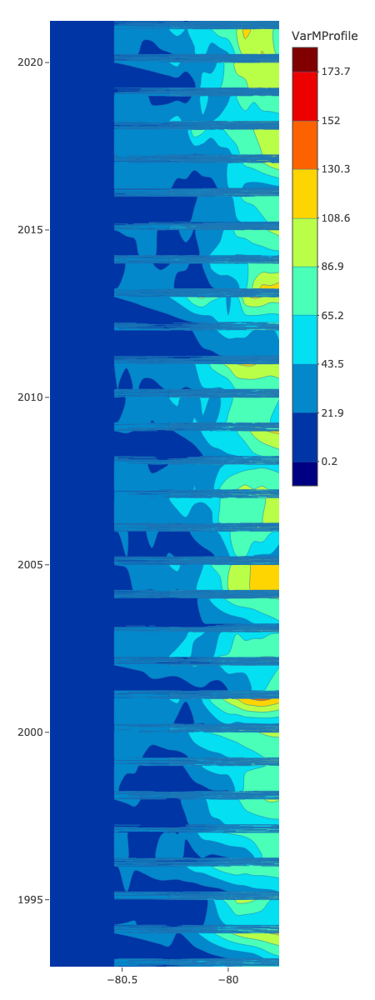

Hovmoller
================

# Monthly averages

Here, each time data point is the average over one month

# Latitude 29

<table>
<colgroup>
<col style="width: 25%" />
<col style="width: 25%" />
<col style="width: 25%" />
<col style="width: 25%" />
</colgroup>
<tbody>
<tr class="odd">
<td style="text-align: center;">

<h1 id="bottom-temperature">Bottom Temperature</h1>

</td>
<td style="text-align: center;">

<h1 id="ssh">SSH</h1>

</td>
<td style="text-align: center;">

<h1 id="sst">SST</h1>

</td>
<td style="text-align: center;">

<h1 id="mixed-layer">Mixed Layer</h1>

</td>
</tr>
</tbody>
</table>

# Latitude 30

<table>
<colgroup>
<col style="width: 25%" />
<col style="width: 25%" />
<col style="width: 25%" />
<col style="width: 25%" />
</colgroup>
<tbody>
<tr class="odd">
<td style="text-align: center;">

<h1 id="bottom-temperature-1">Bottom Temperature</h1>

</td>
<td style="text-align: center;">

<h1 id="ssh-1">SSH</h1>

</td>
<td style="text-align: center;">

<h1 id="sst-1">SST</h1>

</td>
<td style="text-align: center;">

<h1 id="mixed-layer-1">Mixed Layer</h1>

</td>
</tr>
</tbody>
</table>

# Latitude 31

<table>
<colgroup>
<col style="width: 25%" />
<col style="width: 25%" />
<col style="width: 25%" />
<col style="width: 25%" />
</colgroup>
<tbody>
<tr class="odd">
<td style="text-align: center;">

<h1 id="bottom-temperature-2">Bottom Temperature</h1>

</td>
<td style="text-align: center;">

<h1 id="ssh-2">SSH</h1>

</td>
<td style="text-align: center;">

<h1 id="sst-2">SST</h1>

</td>
<td style="text-align: center;">

<h1 id="mixed-layer-2">Mixed Layer</h1>

</td>
</tr>
</tbody>
</table>

# Latitude 32

<table>
<colgroup>
<col style="width: 25%" />
<col style="width: 25%" />
<col style="width: 25%" />
<col style="width: 25%" />
</colgroup>
<tbody>
<tr class="odd">
<td style="text-align: center;">

<h1 id="bottom-temperature-3">Bottom Temperature</h1>

</td>
<td style="text-align: center;">

<h1 id="ssh-3">SSH</h1>

</td>
<td style="text-align: center;">

<h1 id="sst-3">SST</h1>

</td>
<td style="text-align: center;">

<h1 id="mixed-layer-3">Mixed Layer</h1>

</td>
</tr>
</tbody>
</table>

# Daily Seasonal

Here, each time data point is one day of the season

# Latitude 29

<table>
<colgroup>
<col style="width: 25%" />
<col style="width: 25%" />
<col style="width: 25%" />
<col style="width: 25%" />
</colgroup>
<tbody>
<tr class="odd">
<td style="text-align: center;">

<h1 id="fall">Fall</h1>

</td>
<td style="text-align: center;">

<h1 id="summer">Summer</h1>

</td>
<td style="text-align: center;">

<h1 id="spring">Spring</h1>

</td>
<td style="text-align: center;">

<h1 id="winter">Winter</h1>

</td>
</tr>
</tbody>
</table>

# SSH

# Fall

# Summer

# Spring

# Winter

:::

# SST

# Fall

# Summer

# Spring

# Winter

:::

# Mixed Layer

# Fall

# Summer

# Spring

# Winter

:::

# Latitude 30

<table>
<colgroup>
<col style="width: 25%" />
<col style="width: 25%" />
<col style="width: 25%" />
<col style="width: 25%" />
</colgroup>
<tbody>
<tr class="odd">
<td style="text-align: center;">

<h1 id="fall-4">Fall</h1>

</td>
<td style="text-align: center;">

<h1 id="summer-4">Summer</h1>

</td>
<td style="text-align: center;">

<h1 id="spring-4">Spring</h1>

</td>
<td style="text-align: center;">

<h1 id="winter-4">Winter</h1>

</td>
</tr>
</tbody>
</table>

# SSH

# Fall

# Summer

# Spring

# Winter

:::

# SST

# Fall

# Summer

# Spring

# Winter

:::

# Mixed Layer

# Fall

# Summer

# Spring

# Winter

:::

# Latitude 31

<table>
<colgroup>
<col style="width: 25%" />
<col style="width: 25%" />
<col style="width: 25%" />
<col style="width: 25%" />
</colgroup>
<tbody>
<tr class="odd">
<td style="text-align: center;">

<h1 id="fall-8">Fall</h1>

</td>
<td style="text-align: center;">

<h1 id="summer-8">Summer</h1>

</td>
<td style="text-align: center;">

<h1 id="spring-8">Spring</h1>

</td>
<td style="text-align: center;">

<h1 id="winter-8">Winter</h1>

</td>
</tr>
</tbody>
</table>

# SSH

# Fall

# Summer

# Spring

# Winter

:::

# SST

# Fall

# Summer

# Spring

# Winter

:::

# Mixed Layer

# Fall

# Summer

# Spring

# Winter

:::

# Latitude 32

<table>
<colgroup>
<col style="width: 25%" />
<col style="width: 25%" />
<col style="width: 25%" />
<col style="width: 25%" />
</colgroup>
<tbody>
<tr class="odd">
<td style="text-align: center;">

<h1 id="fall-12">Fall</h1>

</td>
<td style="text-align: center;">

<h1 id="summer-12">Summer</h1>

</td>
<td style="text-align: center;">

<h1 id="spring-12">Spring</h1>

</td>
<td style="text-align: center;">

<h1 id="winter-12">Winter</h1>

</td>
</tr>
</tbody>
</table>

# SSH

# Fall

# Summer

# Spring

# Winter

:::

# SST

# Fall

# Summer

# Spring

# Winter

:::

# Mixed Layer

# Fall

# Summer

# Spring

# Winter

:::
