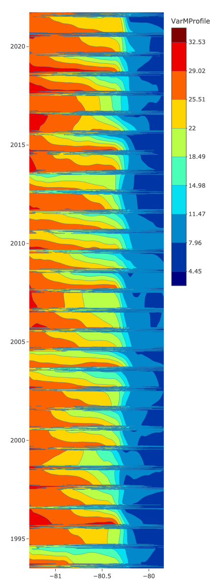
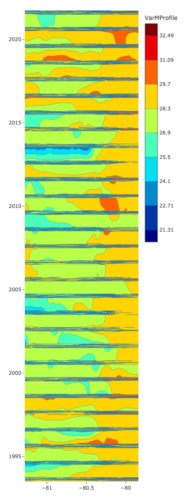

Hovmoller
================

# Monthly averages

Here, each time data point is the average over one month

# Latitude 29

<table>
<colgroup>
<col style="width: 25%" />
<col style="width: 25%" />
<col style="width: 25%" />
<col style="width: 25%" />
</colgroup>
<tbody>
<tr class="odd">
<td style="text-align: center;">

<h1 id="bottom-temperature">Bottom Temperature</h1>

</td>
<td style="text-align: center;">

<h1 id="ssh">SSH</h1>

</td>
<td style="text-align: center;">

<h1 id="sst">SST</h1>

</td>
<td style="text-align: center;">

<h1 id="mixed-layer">Mixed Layer</h1>

</td>
</tr>
</tbody>
</table>

# Latitude 30

<table>
<colgroup>
<col style="width: 25%" />
<col style="width: 25%" />
<col style="width: 25%" />
<col style="width: 25%" />
</colgroup>
<tbody>
<tr class="odd">
<td style="text-align: center;">

<h1 id="bottom-temperature-1">Bottom Temperature</h1>

</td>
<td style="text-align: center;">

<h1 id="ssh-1">SSH</h1>

</td>
<td style="text-align: center;">

<h1 id="sst-1">SST</h1>

</td>
<td style="text-align: center;">

<h1 id="mixed-layer-1">Mixed Layer</h1>

</td>
</tr>
</tbody>
</table>

# Latitude 31

<table>
<colgroup>
<col style="width: 25%" />
<col style="width: 25%" />
<col style="width: 25%" />
<col style="width: 25%" />
</colgroup>
<tbody>
<tr class="odd">
<td style="text-align: center;">

<h1 id="bottom-temperature-2">Bottom Temperature</h1>

</td>
<td style="text-align: center;">

<h1 id="ssh-2">SSH</h1>

</td>
<td style="text-align: center;">

<h1 id="sst-2">SST</h1>

</td>
<td style="text-align: center;">

<h1 id="mixed-layer-2">Mixed Layer</h1>

</td>
</tr>
</tbody>
</table>

# Latitude 32

<table>
<colgroup>
<col style="width: 25%" />
<col style="width: 25%" />
<col style="width: 25%" />
<col style="width: 25%" />
</colgroup>
<tbody>
<tr class="odd">
<td style="text-align: center;">

<h1 id="bottom-temperature-3">Bottom Temperature</h1>

</td>
<td style="text-align: center;">

<h1 id="ssh-3">SSH</h1>

</td>
<td style="text-align: center;">

<h1 id="sst-3">SST</h1>

</td>
<td style="text-align: center;">

<h1 id="mixed-layer-3">Mixed Layer</h1>

</td>
</tr>
</tbody>
</table>

# Daily Seasonal

Here, each time data point is one day of the season

# Latitude 29

# Bottom Temperature

<table>
<colgroup>
<col style="width: 25%" />
<col style="width: 25%" />
<col style="width: 25%" />
<col style="width: 25%" />
</colgroup>
<tbody>
<tr class="odd">
<td style="text-align: center;">

<h1 id="fall">Fall</h1>

</td>
<td style="text-align: center;">

<h1 id="summer">Summer</h1>

</td>
<td style="text-align: center;">

<h1 id="spring">Spring</h1>

</td>
<td style="text-align: center;">

<h1 id="winter">Winter</h1>

</td>
</tr>
</tbody>
</table>

# SSH

<table>
<colgroup>
<col style="width: 25%" />
<col style="width: 25%" />
<col style="width: 25%" />
<col style="width: 25%" />
</colgroup>
<tbody>
<tr class="odd">
<td style="text-align: center;">

<h1 id="fall-1">Fall</h1>

</td>
<td style="text-align: center;">

<h1 id="summer-1">Summer</h1>

</td>
<td style="text-align: center;">

<h1 id="spring-1">Spring</h1>

</td>
<td style="text-align: center;">

<h1 id="winter-1">Winter</h1>

</td>
</tr>
</tbody>
</table>

# SST

<table>
<colgroup>
<col style="width: 25%" />
<col style="width: 25%" />
<col style="width: 25%" />
<col style="width: 25%" />
</colgroup>
<tbody>
<tr class="odd">
<td style="text-align: center;">

<h1 id="fall-2">Fall</h1>

</td>
<td style="text-align: center;">

<h1 id="summer-2">Summer</h1>

</td>
<td style="text-align: center;">

<h1 id="spring-2">Spring</h1>

</td>
<td style="text-align: center;">

<h1 id="winter-2">Winter</h1>

</td>
</tr>
</tbody>
</table>

# Mixed Layer

<table>
<colgroup>
<col style="width: 25%" />
<col style="width: 25%" />
<col style="width: 25%" />
<col style="width: 25%" />
</colgroup>
<tbody>
<tr class="odd">
<td style="text-align: center;">

<h1 id="fall-3">Fall</h1>

</td>
<td style="text-align: center;">

<h1 id="summer-3">Summer</h1>

</td>
<td style="text-align: center;">

<h1 id="spring-3">Spring</h1>

</td>
<td style="text-align: center;">

<h1 id="winter-3">Winter</h1>

</td>
</tr>
</tbody>
</table>

# Latitude 30

# Bottom Temperature

<table>
<colgroup>
<col style="width: 25%" />
<col style="width: 25%" />
<col style="width: 25%" />
<col style="width: 25%" />
</colgroup>
<tbody>
<tr class="odd">
<td style="text-align: center;">

<h1 id="fall-4">Fall</h1>

</td>
<td style="text-align: center;">

<h1 id="summer-4">Summer</h1>

</td>
<td style="text-align: center;">

<h1 id="spring-4">Spring</h1>

</td>
<td style="text-align: center;">

<h1 id="winter-4">Winter</h1>

</td>
</tr>
</tbody>
</table>

# SSH

<table>
<colgroup>
<col style="width: 25%" />
<col style="width: 25%" />
<col style="width: 25%" />
<col style="width: 25%" />
</colgroup>
<tbody>
<tr class="odd">
<td style="text-align: center;">

<h1 id="fall-5">Fall</h1>

</td>
<td style="text-align: center;">

<h1 id="summer-5">Summer</h1>

</td>
<td style="text-align: center;">

<h1 id="spring-5">Spring</h1>

</td>
<td style="text-align: center;">

<h1 id="winter-5">Winter</h1>

</td>
</tr>
</tbody>
</table>

# SST

<table>
<colgroup>
<col style="width: 25%" />
<col style="width: 25%" />
<col style="width: 25%" />
<col style="width: 25%" />
</colgroup>
<tbody>
<tr class="odd">
<td style="text-align: center;">

<h1 id="fall-6">Fall</h1>

</td>
<td style="text-align: center;">

<h1 id="summer-6">Summer</h1>

</td>
<td style="text-align: center;">

<h1 id="spring-6">Spring</h1>

</td>
<td style="text-align: center;">

<h1 id="winter-6">Winter</h1>

</td>
</tr>
</tbody>
</table>

# Mixed Layer

<table>
<colgroup>
<col style="width: 25%" />
<col style="width: 25%" />
<col style="width: 25%" />
<col style="width: 25%" />
</colgroup>
<tbody>
<tr class="odd">
<td style="text-align: center;">

<h1 id="fall-7">Fall</h1>

</td>
<td style="text-align: center;">

<h1 id="summer-7">Summer</h1>

</td>
<td style="text-align: center;">

<h1 id="spring-7">Spring</h1>

</td>
<td style="text-align: center;">

<h1 id="winter-7">Winter</h1>

</td>
</tr>
</tbody>
</table>

# Latitude 31

# Bottom Temperature

<table>
<colgroup>
<col style="width: 25%" />
<col style="width: 25%" />
<col style="width: 25%" />
<col style="width: 25%" />
</colgroup>
<tbody>
<tr class="odd">
<td style="text-align: center;">

<h1 id="fall-8">Fall</h1>

</td>
<td style="text-align: center;">

<h1 id="summer-8">Summer</h1>

</td>
<td style="text-align: center;">

<h1 id="spring-8">Spring</h1>

</td>
<td style="text-align: center;">

<h1 id="winter-8">Winter</h1>

</td>
</tr>
</tbody>
</table>

# SSH

<table>
<colgroup>
<col style="width: 25%" />
<col style="width: 25%" />
<col style="width: 25%" />
<col style="width: 25%" />
</colgroup>
<tbody>
<tr class="odd">
<td style="text-align: center;">

<h1 id="fall-9">Fall</h1>

</td>
<td style="text-align: center;">

<h1 id="summer-9">Summer</h1>

</td>
<td style="text-align: center;">

<h1 id="spring-9">Spring</h1>

</td>
<td style="text-align: center;">

<h1 id="winter-9">Winter</h1>

</td>
</tr>
</tbody>
</table>

# SST

<table>
<colgroup>
<col style="width: 25%" />
<col style="width: 25%" />
<col style="width: 25%" />
<col style="width: 25%" />
</colgroup>
<tbody>
<tr class="odd">
<td style="text-align: center;">

<h1 id="fall-10">Fall</h1>

</td>
<td style="text-align: center;">

<h1 id="summer-10">Summer</h1>

</td>
<td style="text-align: center;">

<h1 id="spring-10">Spring</h1>

</td>
<td style="text-align: center;">

<h1 id="winter-10">Winter</h1>

</td>
</tr>
</tbody>
</table>

# Mixed Layer

<table>
<colgroup>
<col style="width: 25%" />
<col style="width: 25%" />
<col style="width: 25%" />
<col style="width: 25%" />
</colgroup>
<tbody>
<tr class="odd">
<td style="text-align: center;">

<h1 id="fall-11">Fall</h1>

</td>
<td style="text-align: center;">

<h1 id="summer-11">Summer</h1>

</td>
<td style="text-align: center;">

<h1 id="spring-11">Spring</h1>

</td>
<td style="text-align: center;">

<h1 id="winter-11">Winter</h1>

</td>
</tr>
</tbody>
</table>

# Latitude 32

# Bottom Temperature

<table>
<colgroup>
<col style="width: 25%" />
<col style="width: 25%" />
<col style="width: 25%" />
<col style="width: 25%" />
</colgroup>
<tbody>
<tr class="odd">
<td style="text-align: center;">

<h1 id="fall-12">Fall</h1>

</td>
<td style="text-align: center;">

<h1 id="summer-12">Summer</h1>

</td>
<td style="text-align: center;">

<h1 id="spring-12">Spring</h1>

</td>
<td style="text-align: center;">

<h1 id="winter-12">Winter</h1>

</td>
</tr>
</tbody>
</table>

# SSH

<table>
<colgroup>
<col style="width: 25%" />
<col style="width: 25%" />
<col style="width: 25%" />
<col style="width: 25%" />
</colgroup>
<tbody>
<tr class="odd">
<td style="text-align: center;">

<h1 id="fall-13">Fall</h1>

</td>
<td style="text-align: center;">

<h1 id="summer-13">Summer</h1>

</td>
<td style="text-align: center;">

<h1 id="spring-13">Spring</h1>

</td>
<td style="text-align: center;">

<h1 id="winter-13">Winter</h1>

</td>
</tr>
</tbody>
</table>

# SST

<table>
<colgroup>
<col style="width: 25%" />
<col style="width: 25%" />
<col style="width: 25%" />
<col style="width: 25%" />
</colgroup>
<tbody>
<tr class="odd">
<td style="text-align: center;">

<h1 id="fall-14">Fall</h1>

</td>
<td style="text-align: center;">

<h1 id="summer-14">Summer</h1>

</td>
<td style="text-align: center;">

<h1 id="spring-14">Spring</h1>

</td>
<td style="text-align: center;">

<h1 id="winter-14">Winter</h1>

</td>
</tr>
</tbody>
</table>

# Mixed Layer

<table>
<colgroup>
<col style="width: 25%" />
<col style="width: 25%" />
<col style="width: 25%" />
<col style="width: 25%" />
</colgroup>
<tbody>
<tr class="odd">
<td style="text-align: center;">

<h1 id="fall-15">Fall</h1>

</td>
<td style="text-align: center;">

<h1 id="summer-15">Summer</h1>

</td>
<td style="text-align: center;">

<h1 id="spring-15">Spring</h1>

</td>
<td style="text-align: center;">

<h1 id="winter-15">Winter</h1>

</td>
</tr>
</tbody>
</table>

